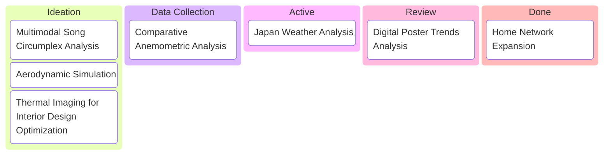

Hello there! Welcome to my personal space :D

I do projects in various subjects but I'm mainly interested in Data Science. My formal background may not supplement me with basic knowledge in the projects but I'm truly passionate about them. Below is the list of projects I'm currently working on. Feel free to contact me through [email](mailto:zelvy.fauzan2000@gmail.com) for collaboration or just some casual chats.

During my bachelor in [Universitas Siliwangi](https://unsil.ac.id/), I focused my studies on the impact of digital technology on academic wriring skills. I then continued my master in English Language Education in [Universitas Sebelas Maret](https://uns.ac.id/). I shifted my research interest to positive psychology of teachers, specifically on profiling how EFL teachers cope with job burnout.

Now I'm working as a teacher at a public junior high school in Jalaksana. I teach `Computer Science` and `Character Building` subjects, as well as the school's [computer technician](https://ze-fn.github.io/blog/2026/checkup-komputer-tka/). In my free times, I work on various projects (see more [here](https://ze-fn.github.io/blog/category/portfolio/)), listening to music, playing some games, and sometimes writing a [journal](https://www.instagram.com/zelvy.fauzan/) using fountain pen.

My favourite fountain pen is the [Pilot Metropolitan with Extra Fine nib](https://www.instagram.com/p/DDqrVMcpjCC/)!
