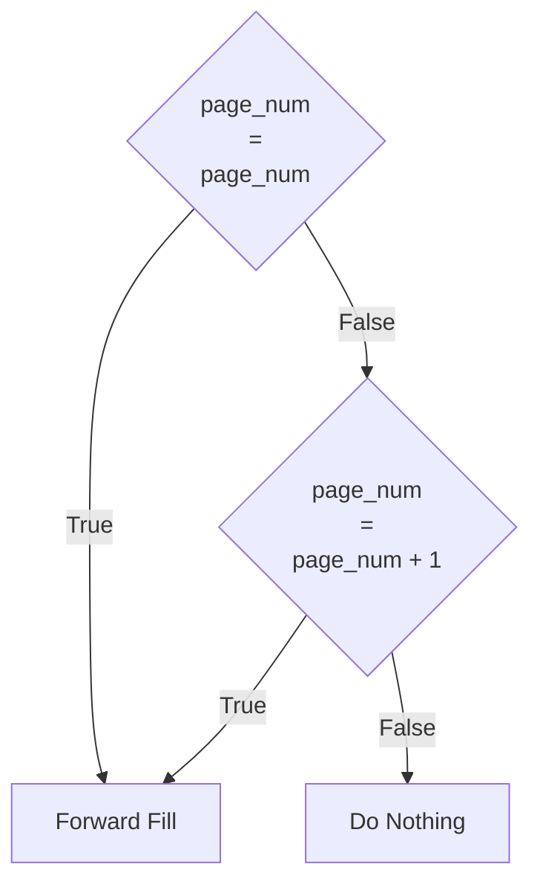

## Tautan

[File R Markdown](https://github.com/ze-fn/CPNS-Kemendik/blob/main/laporan2024.Rmd)
[Mirror RPubs](https://rpubs.com/ze-fn/cpns-kemendik-2024)

## Abstrak

Persaingan dalam tes Calon Pegawai Negeri Sipil (CPNS) Negara Indonesia, utamanya pada Kementerian Pendidikan, sangatlah ketat. Hal ini disebabkan jumlah pelamar yang sangat banyak. Oleh karena itu, peserta CPNS perlu persiapan yang matang untuk menghadapi tes CPNS. Walau begitu, hal tersebut masih meninggalkan pertanyaan di dalam benak: seberapa banyak persiapan yang harus disiapkan untuk lulus tes CPNS? Investigasi kali ini menganalisa hasil tes CPNS di Kementerian Pendidikan yang diselenggarakan pada 2024 untuk mencari tahu seberapa banyak persiapan yang dibutuhkan oleh peserta CPNS untuk lulus di tes CPNS di periode mendatang. Dengan menggunakan pendekatan statistik deskriptif, studi ini menguak bahwa setiap jabatan formasi memiliki tren skor CPNS yang unik satu sama lain, dan bahwa peluang untuk lulus CPNS ditentukan dari banyaknya pelamar pada suatu jabatan formasi per sub bagian per bagian per institusi. Hal ini menekankan implikasi bahwa peserta CPNS di periode mendatang disarankan untuk memilah dan memilih jabatan formasi berdasarkan jumlah frekuensi pelamar di lokasi yang diminati.

***Kata Kunci:** CPNS, Kementerian Pendidikan, Statistik Deskriptif*

## Pendahuluan

Bagian ini memaparkan latar belakang, pertanyaan riset, tujuan riset, kontribusi riset, dan sumber data--secara berurutan.

### Latar Belakang

Berawal dari pengalaman kegagalan dalam menghadapi CPNS 2024, saya membuat analisis hasil CPNS (Calon Pegawai Negeri Sipil) untuk mengetahui lebih mendalam tentang kompetitor saya. Walau begitu, pengumuman hasil CPNS yang dipublikasikan oleh Kementerian sangat sulit untuk dianalisis mengingat jumlah halamannya yang banyak. Oleh karena itu, saya berinisiatif untuk melakukan analisis data hasil CPNS menggunakan teknik rekayasa informasi (*data engineerfing, data analysis*). Selain itu, mengingat banyak rekan saya yang memiliki cita-cita untuk menjadi ASN (Aparatur Sipil Negara), hasil analisis ini saya persembahkan untuk seluruh warga Indonesia yang hendak menjadi ASN di kemudian hari.

Mengingat pengumuman hasil CPNS yang disiarkan per instansi, akan sangat sulit bagi saya untuk mendapatkan semua data secara holistik. Selain itu, lingkungan sosial dimana saya tumbuh didominasi dengan (calon) pendidik sehingga saya tertarik dengan data yang lebih spesifik. Dengan pertimbangan ini, saya memutuskan untuk mengambil data dari Kementerian yang berhubungan dengan dunia pendidikan. Di sini saya tidak spesifik merujuk pada Kementerian Pendidikan Dasar dan Menengah (Kemendikdasmen) ataupun Kementerian Pendidikan, Kebudayaan, Riset, dan Teknologi (Kemendikbudristek) karena nama Kementerian cenderung berganti seiring dengan pergantian kepemimpinan negara. Dengan pertimbangan ini, saya memutuskan untuk menggunakan terminologi Kementerian Pendidikan (Kemendik) sebagai definisi payung untuk Kementerian yang bergerak secara khusus di bidang pendidikan.

Proyek ini bersifat kontinyu/berkelanjutan. Pengumuman hasil CPNS 5 periode sebelum 2024 dan setelah periode 2024 (dan seterusnya) akan saya analisis.

### Pertanyaan Riset

Investigasi ini memiliki beberapa pertanyaan yang akan memandu proses analisis, diantaranya adalah:

1.  Secara umum, berapa skor TWK, TIU, TKP, dan total yang aman untuk lolos ke tahap SKB?
2.  Berapa skor TWK, TIU, TKP, dan total yang aman bagi pelamar dengan latar pendidikan dari rumpun keguruan dan ilmu pendidikan untuk lolos ke tahap SKB?
3.  Berapa skor TWK, TIU, TKP, dan total yang aman bagi pelamar dengan latar pendidikan dari rumpun non keguruan dan ilmu pendidikan untuk lolos ke tahap SKB?
4.  Berapa skor TWK, TIU, TKP, dan total yang aman bagi pelamar dengan latar pendidikan dan tujuan jabatan formasi yang berkaitan dengan "Inggris" untuk lolos ke tahap SKB?
5.  Berapa skor TWK, TIU, TKP, dan total yang aman bagi pelamar Dosen Asisten Ahli dan kualifikasi latar pendidikan yang berkaitan dengan "Inggris" untuk lolos ke tahap SKB?
6.  Berapa skor TWK, TIU, TKP, dan total yang aman bagi pelamar dengan latar pendidikan yang berkaitan dengan "Fisika" untuk lolos ke tahap SKB?
7.  Berapa skor TWK, TIU, TKP, dan total yang aman bagi pelamar Widyaiswara untuk lolos ke tahap SKB?
8.  Secara umum, berapa skor SKB yang aman untuk lolos tahap SKB?
9.  Berapa skor SKB yang aman bagi pelamar dengan latar pendidikan dari rumpun keguruan dan ilmu pendidikan untuk lolos tahap SKB?
10. Berapa skor SKB yang aman bagi pelamar dengan latar pendidikan dari rumpun non keguruan dan ilmu pendidikan untuk lolos tahap SKB?
11. Berapa skor SKB yang aman bagi pelamar dengan latar pendidikan yang berkaitan dengan "Inggris" untuk lolos tahap SKB?
12. Berapa skor SKB yang aman bagi pelamar Dosen Asisten Ahli untuk formasi yang berkaitan dengan "Inggris" untuk lolos tahap SKB?
13. Berapa skor SKB yang aman bagi pelamar dengan latar pendidikan yang berkaitan dengan "Fisika" untuk lolos tahap SKB?
14. Berapa skor SKB yang aman bagi pelamar WIdyaiswara untuk lolos tahap SKB?
15. Di masing-masing formasi jabatan CPNS 2024 Kemendik, berapa proporsi kelulusan SKD-nya?
16. Di masing-masing formasi jabatan CPNS 2024 Kemendik, berapa proporsi kelulusan SKB-nya?
17. Jabatan formasi di instansi mana yang paling banyak peminatnya?
18. Jabatan formasi di instansi mana yang paling sedikit peminatnya?
19. Daerah mana yang paling banyak diminati oleh pelamar CPNS 2024 Kemendik?
20. Daerah mana yang paling sedikit diminati oleh pelamar CPNS 2024 Kemendik?
21. Berapa probabilitas lulus menjadi PNS jika latar belakang pendidikan yang dimiliki adalah S-2 Pendidikan Bahasa Inggris dan posisi yang dilamar adalah Dosen Asisten Ahli?
22. Berapa probabilitas lulus menjadi PNS jika latar belakang pendidikan yang dimiliki adalah S-3 Pendidikan Bahasa Inggris dan posisi yang dilamar adalah Dosen Lektor?
23. Berapa probabilitas lulus menjadi PNS jika latar belakang pendidikan yang dimiliki adalah S-2 Pendidikan Bahasa Inggris dan posisi yang dilamar adalah Widyaiswara?
24. Berapa probabilitas lulus menjadi PNS di setiap formasi yang ada jika latar belakang pendidikan yang dimiliki adalah S-2 Pendidikan Bahasa Inggris?
25. Berapa probabilitas lulus menjadi PNS jika latar belakang pendidikan yang dimiliki adalah S-2 Pendidikan Fisika dan posisi yang dilamar adalah Dosen Asisten Ahli?
26. Berapa probabilitas lulus menjadi PNS jika latar belakang pendidikan yang dimiliki adalah S-3 Pendidikan Fisika dan posisi yang dilamar adalah Dosen Lektor?
27. Berapa probabilitas lulus menjadi PNS jika latar belakang pendidikan yang dimiliki adalah S-2 Pendidikan Fisika dan posisi yang dilamar adalah Widyaiswara?
28. Berapa probabilitas lulus menjadi PNS di setiap formasi yang ada jika latar belakang pendidikan yang dimiliki adalah S-2 Pendidikan Fisika?

### Tujuan Riset

Secara umum, dilakukannya investigasi ini adalah untuk memberikan gambaran umum tentang kompetitor pada rekrutmen CPNS. Tujuan lebih spesifik tertera di bawah ini:

1.  Menentukan skor TWK, TIU, TKP, dan total yang aman secara umum untuk lolos ke tahap SKB.
2.  Menentukan skor TWK, TIU, TKP, dan total yang aman bagi pelamar dengan latar pendidikan dari rumpun keguruan dan ilmu pendidikan untuk lolos ke tahap SKB.
3.  Menentukan skor TWK, TIU, TKP, dan total yang aman bagi pelamar dengan latar pendidikan dari rumpun non keguruan dan ilmu pendidikan untuk lolos ke tahap SKB.
4.  Menentukan skor TWK, TIU, TKP, dan total yang aman bagi pelamar dengan latar pendidikan dan tujuan jabatan formasi yang berkaitan dengan "Inggris" untuk lolos ke tahap SKB.
5.  Menentukan skor TWK, TIU, TKP, dan total yang aman bagi pelamar Dosen Asisten Ahli dan kualifikasi latar pendidikan yang berkaitan dengan "Inggris" untuk lolos ke tahap SKB.
6.  Menentukan skor TWK, TIU, TKP, dan total yang aman bagi pelamar dengan latar pendidikan yang berkaitan dengan "Fisika" untuk lolos ke tahap SKB.
7.  Menentukan skor TWK, TIU, TKP, dan total yang aman bagi pelamar Widyaiswara untuk lolos ke tahap SKB.
8.  Menentukan skor SKB yang aman secara umum untuk lolos tahap SKB.
9.  Menentukan skor SKB yang aman bagi pelamar dengan latar pendidikan dari rumpun keguruan dan ilmu pendidikan untuk lolos tahap SKB.
10. Menentukan skor SKB yang aman bagi pelamar dengan latar pendidikan dari rumpun non keguruan dan ilmu pendidikan untuk lolos tahap SKB.
11. Menentukan skor SKB yang aman bagi pelamar dengan latar pendidikan yang berkaitan dengan "Inggris" untuk lolos tahap SKB.
12. Menentukan skor SKB yang aman bagi pelamar Dosen Asisten Ahli untuk formasi yang berkaitan dengan "Inggris" untuk lolos tahap SKB.
13. Menentukan skor SKB yang aman bagi pelamar dengan latar pendidikan yang berkaitan dengan "Fisika" untuk lolos tahap SKB.
14. Menentukan skor SKB yang aman bagi pelamar Widyaiswara untuk lolos tahap SKB.
15. Menghitung proporsi kelulusan SKD di masing-masing formasi jabatan CPNS 2024 Kemendik.
16. Menghitung proporsi kelulusan SKB di masing-masing formasi jabatan CPNS 2024 Kemendik.
17. Mengidentifikasi jabatan formasi di instansi yang paling banyak peminatnya.
18. Mengidentifikasi jabatan formasi di instansi yang paling sedikit peminatnya.
19. Mengidentifikasi daerah yang paling banyak diminati oleh pelamar CPNS 2024 Kemendik.
20. Mengidentifikasi daerah yang paling sedikit diminati oleh pelamar CPNS 2024 Kemendik.
21. Menghitung probabilitas lulus menjadi PNS jika latar belakang pendidikan yang dimiliki adalah S-2 Pendidikan Bahasa Inggris dan posisi yang dilamar adalah Dosen Asisten Ahli.
22. Menghitung probabilitas lulus menjadi PNS jika latar belakang pendidikan yang dimiliki adalah S-3 Pendidikan Bahasa Inggris dan posisi yang dilamar adalah Dosen Lektor.
23. Menghitung probabilitas lulus menjadi PNS jika latar belakang pendidikan yang dimiliki adalah S-2 Pendidikan Bahasa Inggris dan posisi yang dilamar adalah Widyaiswara.
24. Menghitung probabilitas lulus menjadi PNS di setiap formasi yang ada jika latar belakang pendidikan yang dimiliki adalah S-2 Pendidikan Bahasa Inggris.
25. Menghitung probabilitas lulus menjadi PNS jika latar belakang pendidikan yang dimiliki adalah S-2 Pendidikan Fisika dan posisi yang dilamar adalah Dosen Asisten Ahli.
26. Menghitung probabilitas lulus menjadi PNS jika latar belakang pendidikan yang dimiliki adalah S-3 Pendidikan Fisika dan posisi yang dilamar adalah Dosen Lektor.
27. Menghitung probabilitas lulus menjadi PNS jika latar belakang pendidikan yang dimiliki adalah S-2 Pendidikan Fisika dan posisi yang dilamar adalah Widyaiswara.
28. Menghitung probabilitas lulus menjadi PNS di setiap formasi yang ada jika latar belakang pendidikan yang dimiliki adalah S-2 Pendidikan Fisika.

### Kontribusi Riset

Investigasi ini menitikberatkan kontribusi praktikal yang bisa digunakan oleh seluruh warga Indonesia yang memiliki motivasi untuk mengikuti CPNS, terutama bagi mereka yang menargetkan Kementerian Pendidikan. Dengan wawasan yang didapat dari hasil investigasi ini, saya berharap calon PNS dapat membuat rencana belajar yang efektif dan efisien, analisa kompetitor, dan peluang keberhasilan lolos di masing-masing tahap tes CPNS.

Di samping kontribusi praktikal, hasil analisis ini juga menawarkan wawasan yang bersifat teoretis-eksploratif tentang karakteristik dari demografi calon PNS berdasarkan sudut pandang retrospektif. Analisis prediktif yang disajikan dalam hasil investigasi ini juga dapat dijadikan sebagai bahan dasar dalam perencanaan peningkatan mutu SDM (Sumber Daya Alam) PNS generasi yang akan datang.

Tidak terlewat juga kontribusi berupa data empiris yang ditawarkan dari hasil investigasi ini. Jumlah data yang masif ini memiliki nilai yang berharga untuk pengambilan keputusan baik di sektor formal atau informal, di level operasional maupun managerial, dan/atau di level eksekutif.

### Sumber Data

Data diambil dari pengumuman hasil SKD dan SKB (dua pengumuman berbeda) CPNS 2024 spesifik pada Kementerian Pendidikan, Kebudayaan, Riset, dan Teknologi (Kemendikbudristek).

## Persiapan Data

### Perkakas (Library)

Kode di bawah ini akan mempersiapkan *library* yang diperlukan untuk menunjang analisis.

```r
library(tidyverse)
library(ggplot2)
library(ggthemes)
library(ggridges)
library(ggtext)
library(ggdist)
library(glue)
library(patchwork)
library(RColorBrewer)
library(viridis)
library(visdat)
library(psych)
library(MetBrewer)
```

### Impor Data

Data sudah melalui tahap ekstraksi dari PDF ke CSV menggunakan Python. Setelah data diekstrak ke format CSV, data kemudian dibersihkan menggunakan PostgreSQL. Pada dokumen ini, impor data yang dimaksud adalah impor data dari CSV ke R. Kode di bawah ini akan mengimpor data dari CSV ke R.

### Hasil SKD

```r
hasil_skd <- read_csv("2024/test1v3.csv",
                      col_types = cols(rank = col_number(),
                                       twk = col_integer(),
                                       tiu = col_integer(),
                                       tkp = col_integer(),
                                       skd = col_integer(),
                                       allotment = col_integer(),
                                       page_num = col_integer()
                      ))
hasil_skd
```

### Hasil SKB

```r
hasil_skb <- read_csv("2024/test2v1.csv", 
                      col_types = cols(id = col_character())
                      )
hasil_skb
```

### Jabatan Formasi

```r
jabatan_formasi <- read_csv("2024/jabatan_formasi.csv") %>% 
  rename(jp_code = parent)

jabatan_formasi
```

### Lokasi Formasi

```r
lokasi_formasi <- read_csv("2024/lokasi_formasi_cleaning1.csv")
```

### Pembersihan Data

### Dataset SKD

Tahap ini akan memberikan ringkasan jumlah data duplikat. Di sini saya mengecek secara (1) keseluruhan, (2) variabel id, dan (3) variabel full_name.

```r
chk_dupl_skd_all <- sum(duplicated(hasil_skd))
chk_dupl_skd_id <- sum(duplicated(hasil_skd$id))
chk_dupl_skd_full_name <- sum(duplicated(hasil_skd$full_name))

chk_dupl_skd_all
chk_dupl_skd_id
chk_dupl_skd_full_name
```

Ketika dicek berdasarkan variabel *id* dan *full_name*, ada `r chk_dupl_skd_id` dan `r chk_dupl_skd_full_name` data duplikat pada masing-masing variabel *id* dan *full_name*. Inkonsistensi data ini akan menyebabkan menurunnya keakuratan hasil analisis di tahap yang akan datang sehingga perlu didalami lebih lanjut.

```r
hasil_skd %>% 
  select(id, full_name, twk) %>% # tambah variabel full_name dan twk untuk V&V (verifikasi dan validasi)
  group_by(id) %>% 
  filter(n() > 1) %>% 
  ungroup()
```

Variabel `full_name` tampak memiliki duplikat untuk nama yang memiliki sedikit perbedaan. Dalam hal ini, data yang mengandung `\r`, `\n` atau `\r\n`akan dianggap data yang berbeda walaupun secara holistik tidak ada perbedaan. Untuk memperbaiki hal ini, menghapus lalu menyisakan satu data unik dari variabel `id` akan lebih tepat.

```r
hasil_skd_no_dupl <- hasil_skd %>% 
  distinct(id, .keep_all = TRUE)

hasil_skd_no_dupl
```

Perlu dicatat bahwa kolom/variabel `full_name` tidak perlu dibersihkan lebih lanjut (terutama untuk menghapus `\r`, `\n`, atau `\r\n`) karena tidak ada sama sekali urgensi untuk menginvestigasi satu atau sekian nama secara spesifik. Walau begitu, kolom `last_edu` memiliki kendala *new rows* dan/atau *new lines* yang terpatri dalam datanya sehingga pembersihan lanjutan sangat diperlukan untuk tahap analisis.

```r
hasil_skd_no_dupl$last_edu <- 
  str_replace_all(hasil_skd_no_dupl$last_edu, "[\\r\\n]", " ") %>%
  str_squish()

hasil_skd_no_dupl
```

Tahap pembersihan data selanjutnya adalah menyeregamkan data `NULL`. Di dataset ini, data kosong diisi dengan `NULL` atau `NA` (system default R). Data poin `NULL` harus diganti menjadi `NA` (system default R) sehingga menjadi seragam.

```r
hasil_skd_standardized_null <- hasil_skd_no_dupl %>% 
  mutate(across(where(is.character), ~ str_replace_all(.x, "^NULL$", NA_character_)))

hasil_skd_standardized_null
```

Setelah standarisasi data kosong (NULL/NA), langkah selanjutnya adalah melakukan pengisian data kosong. Pada baris data ke 19 sampai 75, banyak data (`jp_code`, `loc_code`, `type_code`, `allotment`) yang kosong karena proses impor data yang kurang akurat dan presisi. Untuk mengisi kekosongan data ini, saya menggunakan *forward filling* dengan kondisi sebagai berikut:



```r
hasil_skd_forward_fill <- hasil_skd_standardized_null %>% 
  mutate(breakk = !(page_num == lag(page_num) | page_num == lag(page_num) + 1),
         group_id = cumsum(replace_na(breakk, TRUE))) %>%
  group_by(group_id) %>% 
  fill(c(jp_code, loc_code, type_code, allotment), .direction = "down") %>% 
  ungroup() %>% 
  select(-breakk, -group_id)

hasil_skd_forward_fill
```

Kolom `twk`, `tiu`, `tkp`, dan `skd` tidak diterapkan *forward filling* ini karena data kosong di kolom tersebut menandakan peserta yang tidak hadir dalam tes CPNS sehingga tidak ada nilai yang terekam. WAlau begitu, nilai `NA` pada 4 kolom tersebut akan digantikan dengan dengan nilai 0 alih-alih `NA`.

```r
hasil_skd_na2zero <- hasil_skd_forward_fill %>% 
  replace_na(list(twk = 0L,
                  tiu = 0L,
                  tkp = 0L,
                  skd = 0L))

hasil_skd_na2zero
```

```r
summary(hasil_skd_na2zero)

which(is.na(hasil_skd_na2zero$rank))
```

### Dataset SKB

Setelah membersihkan dataset SKD, selanjutnya adalah pembersihan dataset SKB. Prosedur pembersihan ini mirip dengan prosedur pembersihan data SKD pada bagian sebelumnya. Diawali dengan pengecekan secara umum tentang dataset SKB.

```r
hasil_skb
sum(duplicated(hasil_skb$id))
```

Tidak tampak data duplikat pada dataset SKB. Namun begitu, kolom `jp_code`, `loc_code`, `type_code`, `edu_qual`, dan `num_edu_qual` memiliki data *NULL* yang tidak konsisten dengan nilai kosong system default R. Maka dari itu, penyeragaman perlu dilakukan untuk standarisasi nilai kosong.

```r
hasil_skb_standardized_nulls <- hasil_skb %>% 
  mutate(across(where(is.character), ~ str_replace_all(.x, "^NULL$", NA_character_)))

hasil_skb_standardized_nulls
```

```r
hasil_skb_forward_fill <- hasil_skb_standardized_nulls %>% 
  mutate(breakk = !(page_num == lag(page_num) | page_num == lag(page_num) + 1),
         group_id = cumsum(replace_na(breakk, TRUE))) %>%
  group_by(group_id) %>% 
  fill(c(jp_code, loc_code, type_code, edu_qual, num_edu_qual), .direction = "down") %>% 
  ungroup() %>% 
  select(-breakk, -group_id)

hasil_skb_forward_fill
```

### Dataset Lokasi Formasi

```r
lokasi_cleaning1 <- lokasi_formasi %>% 
  # Hapus noise "... KEMENTERIAN ..." di dalam data
  mutate(across(c(data1:data6), ~ str_remove(.x, "\\s\\d+\\sKEMENTERIAN.*")))

# Locate data point berdasarkan keywords lalu salin ke kolom baru "instansi"
keywords_instansi <- c("Universitas", "Sekretariat", 
                       "Direktorat", "Institut", 
                       "Politeknik", "Kantor", 
                       "Balai Bahasa Provinsi", "Pusat",
                       "Akademi", "Inspektorat")
pattern_instansi <- paste0("^(", paste(keywords_instansi, collapse = "|"), ")")

lokasi_cleaning1$instansi <- apply(lokasi_cleaning1[c("data1", "data2", "data3", "data4", "data5", "data6")],
                                   1, 
                                   function(row) {
                                     match <- grep(pattern_instansi, 
                                                   row, 
                                                   value = TRUE,
                                                   ignore.case = TRUE)
                                     if (length(match) > 0) match[1] 
                                     else NA})

# Locate data point berdasarkan keywords lalu salin ke kolom baru "fa_bag" (fakultas atau bagian)
keywords_fa_bag <- c("Fakultas", "Badan", "Lembaga",
                     "Balai", "Program Pascasarjana",
                     "Pascasarjana", "Bagian",
                     "Wakil", "UPT", "UPA", "Biro", 
                     "Pusat Layana", "Pusat Prestasi",
                     "Pusat Data", "Unit Penunjang")
pattern_fa_bag <- paste0("^(", paste(keywords_fa_bag, collapse = "|"), ")")

lokasi_cleaning1$fa_bag <- apply(lokasi_cleaning1[c("data1", "data2", "data3", "data4", "data5", "data6")],
                                   1, 
                                   function(row) {
                                     match <- grep(pattern_fa_bag, 
                                                   row, 
                                                   value = TRUE,
                                                   ignore.case = TRUE)
                                     if (length(match) > 0) match[1] 
                                     else NA})

# Locate data point berdasarkan keywords lalu salin ke kolom baru "prodi_subbag" (program studi atau subbagian)
keywords_prodi_subbag <- c("Program Studi", "Prodi",
                           "S-1", "S1", "S2", "S-2", "S3", "S-3",
                           "D1", "D-1", "D-I", "D2", "D-2", "D-II",
                           "D3", "D-3", "D-III", "D4", "D-4", "D-IV",
                           "Jurusan S1", "Jurusan S2", "Jurusan S3",
                           "Program Studi S1", "Program Studi S2",
                           "Jurusan", "Bagian Nutrisi", "Profesi",
                           "Bagian S1", "Bagian S2", 
                           "Balai Guru Penggerak",
                           "Subbagian", "Biro Umum", "Bagian Umum",
                           "Fakultas Program Studi S1", "Biro Kepegawaian",
                           "Biro Keuangan", "Wakil Direktur", "Biro Perencanaan",
                           "Bagian Akademik", "Bagian Ilmu Hukum",
                           "Biro Sumber Daya", "Biro Hukum", "Bagian Hukum Keperdataan",
                           "Balai Pelestarian", "Penyakit Jantung",
                           "Bagian Hukum", "Bagian Produksi")
pattern_prodi_subbag <- paste0("^(", paste(keywords_prodi_subbag, collapse = "|"), ")")

lokasi_cleaning1$prodi_subbag <- apply(lokasi_cleaning1[c("data1", "data2", "data3", "data4", "data5", "data6")],
                                   1, 
                                   function(row) {
                                     match <- grep(pattern_prodi_subbag, 
                                                   row, 
                                                   value = TRUE,
                                                   ignore.case = TRUE)
                                     if (length(match) > 0) match[1] 
                                     else NA})

# Check here
# sum(is.na(lokasi_cleaning1$prodi_subbag))
# lokasi_cleaning1 %>% 
#  filter(is.na(prodi_subbag))

# Return necessary columns
lokasi_cleaning2 <- lokasi_cleaning1 %>% 
  select(loc_code, instansi:prodi_subbag)

# Remove noise dari kolom "fa_bag"
lokasi_cleaning3 <- lokasi_cleaning2 %>% 
  # Hapus noise "\\s\\d+\\d+\\s/*" di dalam data
  mutate(across(c(instansi:prodi_subbag), ~ str_remove(.x, "\\s\\d+\\d+\\s.*"))) %>% 
  distinct(loc_code, .keep_all = TRUE) %>% 
  arrange(loc_code)

lokasi_cleaning3
```

### Hasil Pembersihan Data

Data SKD dan SKB yang sudah bersih dan siap untuk dianalisa sudah direkam dan bisa dipanggil menggunakan variabel berikut:

`hasil_skd_na2zero` *untuk data SKD*

`hasil_skb_forward_fill` *untuk data SKB*

`lokasi_cleaning3` *untuk data lokasi formasi (prototype)*

## Analisis Data

Pada bagian ini, saya menjawab pertanyaan riset tidak secara berurutan seperti pada [Tujuan Riset] namun mengelompokkannya menjadi SKD dan SKB secara terpisah. Hal ini bertujuan untuk meningkatkan fokus bahasan dan diskusi data dan menghindari distraksi yang mungkin akan timbul apabila hasil analisis berpindah-pindah dari SKD ke SKB lalu kembali ke SKD dan diulangi terus menerus. Walau bahasan hasil tes CPNS ini tidak mengikuti kronologi di Tujuan Riset, alur analisis tetap sama dengan yang apa yang tertera.

### RQ1

Skor TWK, TIU, TKP, dan Total yang aman untuk lolos ke tahap SKB

```r
hasil_skd_na2zero %>% 
  select(twk, tiu, tkp, skd) %>% 
  pivot_longer(cols = twk:skd,
               values_to = "skor",
               names_to = "tipe_tes") %>% 
  mutate(tipe_tes = factor(tipe_tes, levels = c("skd", "tkp", "tiu", "twk"))) %>% 
  ggplot(aes(x = skor, y = tipe_tes, fill = tipe_tes)) +
  theme_bw() +
  geom_boxplot(outliers = FALSE) +
  geom_jitter(shape = 1,
              size = .02,
              alpha = .05) +
  labs(title = "Sebaran Nilai Masing-Masing Subtes SKD (Umum)",
       subtitle = 
         paste0("Rekomendasi capaian nilai (Q3):\n", 
           "TWK >= ", round(quantile(hasil_skd_na2zero$twk, .75)), "; ",
           "TIU >= ", round(quantile(hasil_skd_na2zero$tiu, .75)), "; ",
           "TKP >= ", round(quantile(hasil_skd_na2zero$tkp, .75)), "; ",
           "SKD >= ", round(quantile(hasil_skd_na2zero$skd, .75))
           ),
       x = "skor",
       y = "subtes") +
  theme(legend.position = "none")
```

### RQ2

Skor TWK, TIU, TKP, dan Total yang aman bagi lulusan FKIP untuk lolos ke tahap SKB

```r
skd_rumpun_fkip <- hasil_skd_na2zero %>% 
  select(last_edu:skd) %>% 
  filter(str_detect(last_edu, "PENDIDIKAN"))

skd_rumpun_fkip %>% 
  select(-last_edu) %>% 
  pivot_longer(cols = twk:skd,
               names_to = "subtes",
               values_to = "skor") %>% 
  mutate(subtes = factor(subtes, 
                         levels = c("skd", "tkp", "tiu", "twk"))) %>% 
  ggplot(aes(x = skor, y = subtes, fill = subtes)) +
  theme_bw() +
  geom_boxplot(outliers = FALSE) +
  geom_jitter(size = .02,
              alpha = .05) +
  theme(legend.position = "none") +
  labs(title = "Sebaran Nilai SKD rumpun FKIP",
       subtitle = paste0("Rekomendasi capaian nilai (Q3):\n", 
           "TWK >= ", round(quantile(skd_rumpun_fkip$twk, .75)), "; ",
           "TIU >= ", round(quantile(skd_rumpun_fkip$tiu, .75)), "; ",
           "TKP >= ", round(quantile(skd_rumpun_fkip$tkp, .75)), "; ",
           "SKD >= ", round(quantile(skd_rumpun_fkip$skd, .75))
           ),
       x = "skor",
       y = "subtes") +
  theme(legend.position = "none")
```

### RQ3

Skor TWK, TIU, TKP, dan Total yang aman bagi lulusan non-FKIP untuk lolos ke tahap SKB

```r
skd_rumpun_non_fkip <- hasil_skd_na2zero %>% 
  select(last_edu:skd)

skd_rumpun_non_fkip %>% 
  select(-last_edu) %>% 
  pivot_longer(cols = twk:skd,
               names_to = "subtes",
               values_to = "skor") %>% 
  mutate(subtes = factor(subtes, 
                         levels = c("skd", "tkp", "tiu", "twk"))) %>% 
  ggplot(aes(x = skor, y = subtes, fill = subtes)) +
  theme_bw() +
  geom_boxplot(outliers = FALSE) +
  geom_jitter(size = .02,
              alpha = .03) +
  theme(legend.position = "none") +
  labs(title = "Sebaran Nilai SKD rumpun non-FKIP",
       subtitle = paste0("Rekomendasi capaian nilai (Q3):\n", 
           "TWK >= ", round(quantile(skd_rumpun_non_fkip$twk, .75)), "; ",
           "TIU >= ", round(quantile(skd_rumpun_non_fkip$tiu, .75)), "; ",
           "TKP >= ", round(quantile(skd_rumpun_non_fkip$tkp, .75)), "; ",
           "SKD >= ", round(quantile(skd_rumpun_non_fkip$skd, .75))
           ),
       x = "skor",
       y = "subtes") +
  theme(legend.position = "none")
```

### RQ4

Skor TWK, TIU, TKP, dan Total yang aman bagi lulusan jurusan "Inggris" untuk lolos ke tahap SKB di jabatan formasi yang tersedia

```r
skd_jf_ing <- hasil_skd_na2zero %>% 
  filter(str_detect(last_edu, "INGGRIS")) %>% 
  select(jp_code, twk:skd) %>% 
  left_join(jabatan_formasi, by = "jp_code") %>% 
  replace_na(list(job_position = "PENERJEMAH BAHASA INGGRIS")) %>% 
  select(-jp_code)

median_twk_ing <- median(skd_jf_ing$twk, na.rm = TRUE)
median_tiu_ing <- median(skd_jf_ing$tiu, na.rm = TRUE)
median_tkp_ing <- median(skd_jf_ing$tkp, na.rm = TRUE)
median_skd_ing <- median(skd_jf_ing$skd, na.rm = TRUE)
n_skd_ing <- nrow(skd_jf_ing)

font_family <- "Fira Sans"

plot_subtitle_skd_ing <- glue("Komparasi dari berbagai Jabatan Formasi yang
                      tersedia untuk kualifikasi pendidikan yang berkaitan
                      dengan 'Inggris'. (n = {scales::number(n_skd_ing, big.mark = ',')})")

# TWK
skd_jf_ing %>% 
  ggplot(aes(x = twk, y = job_position, fill = ..x..)) +
  geom_density_ridges_gradient() +
  scale_fill_viridis(option = "E") +
  geom_vline(xintercept = median_twk_ing,
             lty = "dashed",
             col = "black") +
  annotate("text", 
           x = median_twk_ing + 16,
           y = 10.2,
           label = glue("Median TWK
                        {scales::number(median_twk_ing)}"),
           #family = font_family,
           size = 3) +
  labs(
    title = glue("Sebaran Nilai TWK"),
    subtitle = plot_subtitle_skd_ing,
    x = "Skor TWK",
    y = "Jabatan Formasi") +
  theme_bw() +
  theme(panel.spacing = unit(0.1, "lines"),
        legend.position = "none") 

# TIU
skd_jf_ing %>% 
  ggplot(aes(x = tiu, y = job_position, fill = ..x..)) +
  geom_density_ridges_gradient() +
  scale_fill_viridis(option = "E") +
  geom_vline(xintercept = median_tiu_ing,
             lty = "dashed",
             col = "black") +
  annotate("text", 
           x = median_tiu_ing + 20,
           y = 10.2,
           label = glue("Median TIU
                        {scales::number(median_tiu_ing)}"),
           #family = font_family,
           size = 3) +
  labs(
    title = glue("Sebaran Nilai TIU"),
    subtitle = plot_subtitle_skd_ing,
    x = "Skor TIU",
    y = "Jabatan Formasi") +
  theme_bw() +
  theme(panel.spacing = unit(0.1, "lines"),
        legend.position = "none") 

# TKP
skd_jf_ing %>% 
  ggplot(aes(x = tkp, y = job_position, fill = ..x..)) +
  geom_density_ridges_gradient() +
  scale_fill_viridis(option = "E") +
  geom_vline(xintercept = median_tkp_ing,
             lty = "dashed",
             col = "black") +
  annotate("text", 
           x = median_tkp_ing + 20,
           y = 10.2,
           label = glue("Median TKP
                        {scales::number(median_tkp_ing)}"),
           #family = font_family,
           size = 3) +
  labs(
    title = glue("Sebaran Nilai TKP"),
    subtitle = plot_subtitle_skd_ing,
    x = "Skor TKP",
    y = "Jabatan Formasi") +
  theme_bw() +
  theme(panel.spacing = unit(0.1, "lines"),
        legend.position = "none") 

# Skor Total SKD
skd_jf_ing %>% 
  ggplot(aes(x = skd, y = job_position, fill = ..x..)) +
  geom_density_ridges_gradient() +
  scale_fill_viridis(option = "E") +
  geom_vline(xintercept = median_skd_ing,
             lty = "dashed",
             col = "black") +
  annotate("text", 
           x = median_skd_ing + 80,
           y = 10.2,
           label = glue("Median Skor Total 
                        {scales::number(median_skd_ing)}"),
           #family = font_family,
           size = 3) +
  labs(
    title = glue("Sebaran Nilai Skor Total"),
    subtitle = plot_subtitle_skd_ing,
    x = "Skor Total",
    y = "Jabatan Formasi") +
  theme_bw() +
  theme(panel.spacing = unit(0.1, "lines"),
        legend.position = "none") 
```

### RQ5

Skor TWK, TIU, TKP, dan Total yang aman bagi pelamar Dosen jurusan "Pendidikan Bahasa Inggris" untuk lolos ke tahap SKB

```r
skd_dosen_ing <- hasil_skd_na2zero %>% 
  select(last_edu:skd, jp_code) %>% 
  left_join(jabatan_formasi, by = "jp_code") %>% 
  filter(str_detect(job_position, "DOSEN"),
         str_detect(last_edu, "PENDIDIKAN BAHASA INGGRIS")) %>% 
  select(-last_edu, -jp_code)


n_skd_dosen_ing <- nrow(skd_dosen_ing)

skd_dosen_ing_long <- skd_dosen_ing %>%
  pivot_longer(cols = twk:skd,
               values_to = "skor",
               names_to = "subtes") %>% 
  mutate(subtes = factor(subtes, levels = c("twk", "tiu", "tkp", "skd")))

plot_subtitle_skd_ing <- glue("Komparasi nilai untuk Jabatan Formasi Dosen (Asisten Ahli, Lektor) bagi pelamar 
                              dengan latar belakang Pendidikan Bahasa Inggris. (n = {scales::number(n_skd_dosen_ing, big.mark = ',')})
                              Rekomendasi Analis (Q3):
                              TWK >= {round(quantile(skd_dosen_ing$twk, 0.75))}; TIU >= {round(quantile(skd_dosen_ing$tiu, 0.75))}; TKP >= {round(quantile(skd_dosen_ing$tkp, 0.75))}; SKD >= {round(quantile(skd_dosen_ing$skd, 0.75))}")

# Histogram faceted
skd_dosen_ing_long %>% 
  ggplot(aes(x = skor, fill = job_position)) +
  geom_histogram(binwidth = 10, alpha = .50) +
  facet_grid(job_position ~ subtes, scale = "free_y") +
  labs(
    title = "Sebaran nilai TWK, TIU, TKP",
    subtitle = plot_subtitle_skd_ing,
    fill = "Jabatan Formasi"
  ) +
  theme_bw() +
  theme(legend.position = "none")

# Density overlap
skd_dosen_ing_long %>% 
  ggplot(aes(x = skor, fill = job_position)) +
  geom_density(alpha = .50) +
  facet_wrap(~subtes) +
  labs(
    title = "Sebaran nilai TWK, TIU, TKP",
    subtitle = plot_subtitle_skd_ing,
    fill = "Jabatan Formasi"
  ) +
  theme_bw()
```

### RQ6

Skor TWK, TIU, TKP, dan Total yang aman bagi lulusan jurusan "Fisika" untuk lolos ke tahap SKB di jabatan formasi yang tersedia

```r
skd_jf_fis <- hasil_skd_na2zero %>% 
  filter(str_detect(last_edu, "FISIKA")) %>% 
  select(jp_code, twk:skd) %>% 
  left_join(jabatan_formasi, by = "jp_code") %>% 
  #replace_na(list(job_position = "PENERJEMAH BAHASA INGGRIS")) %>% 
  select(-jp_code)

median_twk_fis <- median(skd_jf_fis$twk, na.rm = TRUE)
median_tiu_fis <- median(skd_jf_fis$tiu, na.rm = TRUE)
median_tkp_fis <- median(skd_jf_fis$tkp, na.rm = TRUE)
median_skd_fis <- median(skd_jf_fis$skd, na.rm = TRUE)
q3_twk_fis <- quantile(skd_jf_fis$twk, 3/4)
q3_tiu_fis <- quantile(skd_jf_fis$tiu, 3/4)
q3_tkp_fis <- quantile(skd_jf_fis$tkp, 3/4)
q3_skd_fis <- quantile(skd_jf_fis$skd, 3/4)
n_skd_fis <- nrow(skd_jf_fis)
plot_subtitle_skd_fis <- glue("Komparasi dari berbagai Jabatan Formasi yang
                      tersedia untuk kualifikasi pendidikan yang berkaitan
                      dengan 'Fisika'. (n = {scales::number(n_skd_fis, big.mark = ',')})")

```

```r
# TWK
skd_jf_fis %>% 
  ggplot(aes(x = twk, y = job_position, fill = ..x..)) +
  geom_density_ridges_gradient() +
  scale_fill_viridis(option = "G") +
  geom_vline(xintercept = median_twk_fis,
             lty = "dashed",
             col = "black") +
  annotate("text", 
           x = median_twk_fis - 2,
           y = 5,
           label = glue("Median TWK
                        {scales::number(median_twk_fis)}"),
           hjust = 1,
           size = 3) +
  geom_vline(xintercept = q3_twk_fis,
             col = "red") +
  annotate("text", 
           x = q3_twk_fis + 2,
           y = 6,
           label = glue("Q3 TWK
                        {scales::number(q3_twk_fis)}"),
           hjust = 0,
           size = 3) +
  labs(
    title = glue("Sebaran Nilai TWK"),
    subtitle = plot_subtitle_skd_fis,
    x = "Skor TWK",
    y = "Jabatan Formasi") +
  theme_bw() +
  theme(panel.spacing = unit(0.1, "lines"),
        legend.position = "none") 

# TIU
skd_jf_fis %>% 
  ggplot(aes(x = tiu, y = job_position, fill = ..x..)) +
  geom_density_ridges_gradient() +
  scale_fill_viridis(option = "G") +
  geom_vline(xintercept = median_tiu_fis,
             lty = "dashed",
             col = "black") +
  annotate("text", 
           x = median_tiu_fis - 2,
           y = 5,
           label = glue("Median TIU
                        {scales::number(median_tiu_fis)}"),
           hjust = 1,
           size = 3) +
  geom_vline(xintercept = q3_tiu_fis,
             col = "red") +
  annotate("text", 
           x = q3_tiu_fis + 2,
           y = 6,
           label = glue("Q3 TIU
                        {scales::number(q3_tiu_fis)}"),
           hjust = 0,
           size = 3) +
  labs(
    title = glue("Sebaran Nilai TIU"),
    subtitle = plot_subtitle_skd_fis,
    x = "Skor TIU",
    y = "Jabatan Formasi") +
  theme_bw() +
  theme(panel.spacing = unit(0.1, "lines"),
        legend.position = "none") 

# TKP
skd_jf_fis %>% 
  ggplot(aes(x = tkp, y = job_position, fill = ..x..)) +
  geom_density_ridges_gradient() +
  scale_fill_viridis(option = "E") +
  geom_vline(xintercept = median_tkp_fis,
             lty = "dashed",
             col = "black") +
  annotate("text", 
           x = median_tkp_fis - 5,
           y = 5,
           label = glue("Median TKP
                        {scales::number(median_tkp_fis)}"),
           hjust = 1,
           size = 3) +
  geom_vline(xintercept = q3_tkp_fis,
             col = "red") +
  annotate("text", 
           x = q3_tkp_fis + 5,
           y = 6,
           label = glue("Q3 TKP
                        {scales::number(q3_tkp_fis)}"),
           hjust = 0,
           size = 3) +
  labs(
    title = glue("Sebaran Nilai TKP"),
    subtitle = plot_subtitle_skd_fis,
    x = "Skor TKP",
    y = "Jabatan Formasi") +
  theme_bw() +
  theme(panel.spacing = unit(0.1, "lines"),
        legend.position = "none") 

# Skor Total SKD
skd_jf_fis %>% 
  ggplot(aes(x = skd, y = job_position, fill = ..x..)) +
  geom_density_ridges_gradient() +
  scale_fill_viridis(option = "E") +
  geom_vline(xintercept = median_skd_fis,
             lty = "dashed",
             col = "black") +
  annotate("text", 
           x = median_skd_fis - 10,
           y = 5,
           label = glue("Median Skor Total 
                        {scales::number(median_skd_fis)}"),
           hjust = 1,
           size = 3) +
  geom_vline(xintercept = q3_skd_fis,
             col = "red") +
  annotate("text", 
           x = q3_skd_fis + 10,
           y = 6,
           label = glue("Q3 Skor Total
                        {scales::number(q3_skd_fis)}"),
           hjust = 0,
           size = 3) +
  labs(
    title = glue("Sebaran Nilai Skor Total"),
    subtitle = plot_subtitle_skd_fis,
    x = "Skor Total SKD",
    y = "Jabatan Formasi") +
  theme_bw() +
  theme(panel.spacing = unit(0.1, "lines"),
        legend.position = "none") 

```

### RQ7

Skor TWK, TIU, TKP, dan Total yang aman bagi pelamar Widyaiswara untuk lolos ke tahap SKB

```r
skd_wi <- hasil_skd_na2zero %>% 
  select(last_edu:skd, jp_code) %>% 
  left_join(jabatan_formasi, by = "jp_code") %>% 
  filter(str_detect(job_position, "WIDYAISWARA")) %>% 
  select(-last_edu, -jp_code)


n_skd_wi <- nrow(skd_wi)

skd_wi_long <- skd_wi %>%
  pivot_longer(cols = twk:skd,
               values_to = "skor",
               names_to = "subtes") %>% 
  mutate(subtes = factor(subtes, levels = c("twk", "tiu", "tkp", "skd")))

plot_subtitle_wi <- glue("Komparasi nilai untuk Jabatan Formasi Widyaiswara (n = {scales::number(n_skd_dosen_ing, big.mark = ',')})
                              Rekomendasi Analis (Q3):
                              TWK >= {round(quantile(skd_wi$twk, 0.75))}; TIU >= {round(quantile(skd_wi$tiu, 0.75))}; TKP >= {round(quantile(skd_wi$tkp, 0.75))}; SKD >= {round(quantile(skd_wi$skd, 0.75))}")

skd_wi_long %>% 
  ggplot(aes(x = skor, fill = job_position)) +
  geom_density(alpha = .50) +
  facet_wrap(~ subtes) +
  labs(
    title = "Sebaran nilai TWK, TIU, TKP",
    subtitle = plot_subtitle_wi
  ) +
  theme(legend.position = "none") +
  guides(fill = "none") +
  theme_bw()
```

### RQ8

Skor SKB yang aman untuk lolos SKB

```r
q8_skb <- hasil_skb_forward_fill %>% 
  select(skb, decl_code) %>% 
  mutate(decl_code = factor(decl_code, levels = c("TH", "TMS-1", "TMS", "TL", "APS", "P/L-U3", "P/L-U1", "P/L-E3", "P/L-E2", "P/L-E1", "P/L")))

q8_filtered_data <- hasil_skb_forward_fill %>% 
  filter(decl_code != "TH") %>% 
  select(skb)

median_skb <- median(q8_filtered_data$skb)
q3_skb <- quantile(q8_filtered_data$skb, 3/4)

n_skb_all <- q8_skb %>% 
  nrow()

q8_subtitile_plot <- glue("Komparasi skor SKB Umum (n = {scales::number(n_skb_all, big.mark = ',')})")
```

```r
# Ridgeline Plot
q8_skb %>% 
  ggplot(aes(x = skb, y = decl_code, fill = ..x..)) +
  geom_density_ridges_gradient() +
  scale_fill_viridis(option = "G") +
  # Garis vertikal median
  geom_vline(xintercept = median_skb,
             color = "black",
             lty = "dashed") +
  annotate("text", 
           x = median_skb - 2,
           y = 5,
           label = glue("Median SKB\n {scales::number(median_skb)}"),
           hjust = 1) +
  # Garis vertikal Q3
  geom_vline(xintercept = q3_skb,
             color = "red") +
  annotate("text",
           x = q3_skb + 2,
           y = 6,
           label = glue("Q3 SKB\n {scales::number(q3_skb)}"),
           hjust = 0) +
  labs(title = "Distribusi Nilai SKB Umum",
       subtitle = q8_subtitile_plot,
       x = "SKB",
       y = "Status Kelulusan",
       fill = "n") +
  theme_bw()

# Boxplot + Jitter Plot
q8_skb %>% 
  ggplot(aes(x = skb, y = decl_code, fill = decl_code)) +
  geom_boxplot(outliers = FALSE) +
  geom_jitter(shape = 1,
              size = .1,
              alpha = .2) +
  theme(legend.position = "none") +
  labs(title = "Sebaran Nilai SKB Umum",
       subtitle = q8_subtitile_plot,
       x = "SKB",
       y = "Status Kelulusan") +
  guides(fill = "none") +
  # Garis vertikal median
  geom_vline(xintercept = median_skb,
             color = "black") +
  annotate("text", 
           x = median_skb - 2, 
           y = 7,
           label = glue("Median SKB\n {scales::number(median_skb)}"),
           hjust = 1) +
  # Garis vertikal Q3
  geom_vline(xintercept = q3_skb,
             color = "red") +
  annotate("text", 
           x = q3_skb + 2, 
           y = 9,
           label = glue("Q3 SKB\n {scales::number(q3_skb)}"),
           hjust = 0) +
  theme_bw()
```

### RQ9

Skor SKB yang aman bagi lulusan FKIP untuk lolos SKB

```r
skb_fkip <- hasil_skb_forward_fill %>% # Filterisasi lulusan FKIP
  filter(str_detect(last_edu, "PENDIDIKAN")) %>% 
  select(skb, decl_code) %>% 
  mutate(decl_code = factor(decl_code, levels = c("TH", "TMS-1", "TMS", "TL", "APS", "P/L-U3", "P/L-U1", "P/L-E3", "P/L-E2", "P/L-E1", "P/L")))

median_skb_fkip <- median(skb_fkip$skb)
q3_skb_fkip <- quantile(skb_fkip$skb, 3/4)

n_skb_fkip <- skb_fkip %>% 
  nrow()

q9_subtitile_plot <- glue("Komparasi skor SKB lulusan FKIP (n = {scales::number(n_skb_fkip, big.mark = ',')})")
```

```r
# Ridgeline Plot
ggplot(skb_fkip, aes(x = skb, 
                     y = decl_code, 
                     fill = ..x..)) +
  geom_density_ridges_gradient() +
  scale_fill_viridis(option = "G") +
  # Garis vertikal median
  geom_vline(xintercept = median_skb_fkip,
             color = "black",
             lty = "dashed") + 
  annotate("text", 
           x = median_skb_fkip - 2, 
           y = 5,
           hjust = 1, 
           label = glue("Median SKB\n {scales::number(median_skb_fkip)}")) +
  # Garis vertikal Q3
  geom_vline(xintercept = q3_skb_fkip,
             color = "red") +
  annotate("text", 
           x = q3_skb_fkip + 2, 
           y = 6, 
           hjust = 0,
           label = glue("Q3 SKB\n {scales::number(q3_skb_fkip)}")) +
  labs(title = "Sebaran Nilai SKB lulusan FKIP",
       subtitle = q9_subtitile_plot,
       x = "Skor SKB",
       y = "Status Kelulusan") +
  theme_bw()

# Boxplot + Jitter Plot
ggplot(skb_fkip, aes(x = skb, 
                     y = decl_code, 
                     fill = decl_code)) +
  geom_boxplot(outliers = FALSE) +
  geom_jitter(size = .1,
              alpha = .2) +
  # Garis vertikal median
  geom_vline(xintercept = median_skb_fkip,
             color = "black") + 
  annotate("text", 
           x = median_skb_fkip - 2, 
           y = 5,
           hjust = 1, 
           label = glue("Median SKB\n {scales::number(median_skb_fkip)}")) +
  # Garis vertikal Q3
  geom_vline(xintercept = q3_skb_fkip,
             color = "red") +
  annotate("text", 
           x = q3_skb_fkip + 2, 
           y = 6, 
           hjust = 0,
           label = glue("Q3 SKB\n {scales::number(q3_skb_fkip)}")) +
  labs(title = "Sebaran Nilai SKB lulusan FKIP",
       subtitle = q9_subtitile_plot,
       x = "Skor SKB",
       y = "Status Kelulusan") +
  guides(fill = "none") +
  theme_bw()
```

### RQ10

SKor SKB yang aman bagi lulusan non-FKIP untuk lolos SKB

```r
skb_nonfkip <- hasil_skb_forward_fill %>% # Filterisasi lulusan FKIP
  filter(!str_detect(last_edu, "PENDIDIKAN")) %>% 
  select(skb, decl_code) %>% 
  mutate(decl_code = factor(decl_code, levels = c("TH", "TMS-1", "TMS", "TL", "APS", "P/L-U3", "P/L-U1", "P/L-E3", "P/L-E2", "P/L-E1", "P/L")))

median_skb_nonfkip <- median(skb_nonfkip$skb)
q3_skb_nonfkip <- quantile(skb_nonfkip$skb, 3/4)

n_skb_nonfkip <- skb_nonfkip %>% 
  nrow()

q10_subtitle_plot <- glue("Komparasi skor SKB lulusan non-FKIP (n = {scales::number(n_skb_nonfkip, big.mark = ',')})")
```

```r
# Ridgeline Plot
ggplot(skb_nonfkip, aes(x = skb, 
                     y = decl_code, 
                     fill = ..x..)) +
  geom_density_ridges_gradient() +
  scale_fill_viridis(option = "G") +
  # Garis vertikal median
  geom_vline(xintercept = median_skb_nonfkip,
             color = "black",
             lty = "dashed") + 
  annotate("text", 
           x = median_skb_nonfkip - 2, 
           y = 5,
           hjust = 1, 
           label = glue("Median SKB\n {scales::number(median_skb_nonfkip)}")) +
  # Garis vertikal Q3
  geom_vline(xintercept = q3_skb_nonfkip,
             color = "red") +
  annotate("text", 
           x = q3_skb_fkip + 2, 
           y = 6, 
           hjust = 0,
           label = glue("Q3 SKB\n {scales::number(q3_skb_nonfkip)}")) +
  labs(title = "Sebaran Nilai SKB lulusan non-FKIP",
       subtitle = q10_subtitle_plot,
       x = "Skor SKB",
       y = "Status Kelulusan") +
  theme_bw()

# Boxplot + Jitter Plot
ggplot(skb_nonfkip, aes(x = skb, 
                     y = decl_code, 
                     fill = decl_code)) +
  geom_boxplot(outliers = FALSE) +
  geom_jitter(size = .1,
              alpha = .2) +
  # Garis vertikal median
  geom_vline(xintercept = median_skb_nonfkip,
             color = "black") + 
  annotate("text", 
           x = median_skb_nonfkip - 2, 
           y = 7,
           hjust = 1, 
           label = glue("Median SKB\n {scales::number(median_skb_fkip)}")) +
  # Garis vertikal Q3
  geom_vline(xintercept = q3_skb_nonfkip,
             color = "red") +
  annotate("text", 
           x = q3_skb_nonfkip + 2, 
           y = 8, 
           hjust = 0,
           label = glue("Q3 SKB\n {scales::number(q3_skb_nonfkip)}")) +
  labs(title = "Sebaran Nilai SKB lulusan non-FKIP",
       subtitle = q10_subtitle_plot,
       x = "Skor SKB",
       y = "Status Kelulusan") +
  guides(fill = "none") +
  theme_bw()
```

### RQ11

Skor SKB yang aman yang aman bagi lulusan jurusan "Inggris" untuk lolos tahap SKB di jabatan formasi yang tersedia

```r
q11_skb_ing <- hasil_skb_forward_fill %>% 
  filter(str_detect(last_edu, "INGGRIS")) %>% 
  select(skb, decl_code, jp_code) %>% 
  left_join(jabatan_formasi, by = "jp_code") %>% 
  select(-jp_code) %>% 
  replace_na(list(job_position = "PENERJEMAH BAHASA INGGRIS")) %>% 
  mutate(decl_code = factor(decl_code, levels = c("TH", "TMS-1", "TMS", "TL", "APS", "P/L-U3", "P/L-U1", "P/L-E3", "P/L-E2", "P/L-E1", "P/L")))

median_skb_ing <- median(q11_skb_ing$skb)
q3_skb_ing <- quantile(q11_skb_ing$skb, 3/4)

n_q11_skb_ing <- nrow(q11_skb_ing)

q11_subtitle_plot <- glue("Komparasi nilai SKB lulusan terkait 'Inggris' (n = {scales::number(n_q11_skb_ing, big.mark = ',')})")
```

```r
# Ridgeline Plot
q11_skb_ing %>% 
  ggplot(aes(x = skb, y = job_position, fill = ..x..)) +
  geom_density_ridges_gradient() +
  scale_fill_viridis(option = "G") +
  # Garis vertikal median
  geom_vline(xintercept = median_skb_ing,
             color = "black") +
  annotate("text",
           x = median_skb_ing - 2,
           y = 5,
           hjust = 1,
           label = glue("Median SKB\n {scales::number(median_skb_ing)}")) +
  # Garis vertikal Q3
  geom_vline(xintercept = q3_skb_ing,
             color = "red") +
  annotate("text", 
           x = q3_skb_ing + 2,
           y = 6,
           hjust = 0,
           label= glue("Q3 SKB\n {scales::number(q3_skb_ing)}")) +
  labs(title = "Distribusi Skor SKB Lulusan Terkait 'Inggris'",
       subtitle = q11_subtitle_plot,
       x = "Skor SKB",
       y = "Jabatan Formasi") +
  theme_bw()

# Boxplot + Jitter Plot
q11_skb_ing %>% 
  ggplot(aes(x = skb, y = job_position, fill = job_position)) +
  geom_boxplot(outliers = FALSE) +
  geom_jitter(size = 1,
              alpha = .5,
              shape = 1) +
  # Garis vertikal median
  geom_vline(xintercept = median_skb_ing,
             color = "black") +
  annotate("text",
           x = median_skb_ing - 2,
           y = 7,
           hjust = 1,
           label = glue("Median SKB\n {scales::number(median_skb_ing)}")) +
  # Garis vertikal Q3
  geom_vline(xintercept = q3_skb_ing,
             color = "red") +
  annotate("text", 
           x = q3_skb_ing + 2,
           y = 8,
           hjust = 0,
           label= glue("Q3 SKB\n {scales::number(q3_skb_ing)}")) +
  labs(title = "Distribusi Skor SKB Lulusan Terkait 'Inggris'",
       subtitle = q11_subtitle_plot,
       x = "Skor SKB",
       y = "Jabatan Formasi") +
  guides(fill = "none") +
  theme_bw()
```

### RQ12

Skor SKB yang aman bagi pelamar Dosen jurusan "Inggris" untuk lolos tahap SKB

```r
# Filter hanya posisi dosen lulusan Pendidikan Bahasa Inggris
q12_skb_dosen_ing <- hasil_skb_forward_fill %>% 
  filter(str_detect(last_edu, "INGGRIS")) %>% 
  select(skb, decl_code, jp_code) %>% 
  left_join(jabatan_formasi, by = "jp_code") %>% 
  filter(str_detect(job_position, "DOSEN")) %>% 
  select(-jp_code) %>% 
  replace_na(list(job_position = "PENERJEMAH BAHASA INGGRIS")) %>% 
  mutate(decl_code = factor(decl_code, levels = c("TH", "TMS-1", "TMS", "TL", "APS", "P/L-U3", "P/L-U1", "P/L-E3", "P/L-E2", "P/L-E1", "P/L")))

# Filter Dosen Asisten Ahli Pendidikan Bahasa Inggris
q12_skb_dosenaa_ing <- q12_skb_dosen_ing %>% 
  filter(str_detect(job_position, "ASISTEN")) %>%
  select(skb)
median_skb_dosenaa_ing <- median(q12_skb_dosenaa_ing$skb)
q3_skb_dosenaa_ing <- quantile(q12_skb_dosenaa_ing$skb, 3/4)

# Filter Dosen Lektor Pendidikan Bahasa Inggris
q12_skb_dosenl_ing <- q12_skb_dosen_ing %>% 
  filter(str_detect(job_position, "LEKTOR")) %>%
  select(skb)
median_skb_dosenl_ing <- median(q12_skb_dosenl_ing$skb)
q3_skb_dosenl_ing <- quantile(q12_skb_dosenl_ing$skb, 3/4)

n_q12_skb_dosenaa_ing <- nrow(q12_skb_dosenaa_ing)
n_q12_skb_dosenl_ing <- nrow(q12_skb_dosenl_ing)

q12_subtitle_plot_dosenaa <- glue("Komparasi nilai SKB (n = {scales::number(n_q12_skb_dosenaa_ing, big.mark = ',')})")
q12_subtitle_plot_dosenl <- glue("Komparasi nilai SKB (n = {scales::number(n_q12_skb_dosenl_ing, big.mark = ',')})")
```

```r
# Ridgeline Plot Dosen Asisten Ahli
q12_skb_dosen_ing %>% 
  filter(str_detect(job_position, "ASISTEN")) %>%
  ggplot(aes(x = skb, y = decl_code, fill = ..x..)) +
  geom_density_ridges_gradient() +
  scale_fill_viridis(option = "G") +
  # Garis vertikal median
  geom_vline(xintercept = median_skb_dosenaa_ing,
             color = "black") +
  annotate("text",
           x = median_skb_dosenaa_ing - 2,
           y = 5,
           hjust = 1,
           label = glue("Median SKB\n {scales::number(median_skb_dosenaa_ing)}")) +
  # Garis vertikal Q3
  geom_vline(xintercept = q3_skb_dosenaa_ing,
             color = "red") +
  annotate("text", 
           x = q3_skb_dosenaa_ing + 2,
           y = 6,
           hjust = 0,
           label= glue("Q3 SKB\n {scales::number(q3_skb_dosenaa_ing)}")) +
  labs(title = glue("Distribusi Skor SKB Jabatan Formasi Dosen Asisten Ahli 
       Lulusan Pendidikan Bahasa Inggris"),
       subtitle = q12_subtitle_plot_dosenaa,
       x = "Skor SKB",
       y = "Jabatan Formasi") +
  theme_bw()

# Boxplot + Jitter Plot
q12_skb_dosen_ing %>% 
  filter(str_detect(job_position, "ASISTEN")) %>%
  ggplot(aes(x = skb, y = decl_code, fill = decl_code)) +
  geom_boxplot(outliers = FALSE) +
  geom_jitter(size = 1,
              alpha = .5,
              shape = 1) +
  # Garis vertikal median
  geom_vline(xintercept = median_skb_dosenaa_ing,
             color = "black") +
  annotate("text",
           x = median_skb_dosenaa_ing - 2,
           y = 7,
           hjust = 1,
           label = glue("Median SKB\n {scales::number(median_skb_dosenaa_ing)}")) +
  # Garis vertikal Q3
  geom_vline(xintercept = q3_skb_dosenaa_ing,
             color = "red") +
  annotate("text", 
           x = q3_skb_dosenaa_ing + 2,
           y = 8,
           hjust = 0,
           label= glue("Q3 SKB\n {scales::number(q3_skb_dosenaa_ing)}")) +
  labs(title = glue("Distribusi Skor SKB Jabatan Formasi Dosen Asisten Ahli 
       Lulusan Pendidikan Bahasa Inggris"),
       subtitle = q12_subtitle_plot_dosenaa,
       x = "Skor SKB",
       y = "Jabatan Formasi") +
  theme_bw()
```

```r
# Ridgeline Plot Dosen Lektor
q12_skb_dosen_ing %>% 
  filter(str_detect(job_position, "LEKTOR")) %>%
  ggplot(aes(x = skb, y = decl_code, fill = ..x..)) +
  geom_density_ridges_gradient() +
  scale_fill_viridis(option = "G") +
  # Garis vertikal median
  geom_vline(xintercept = median_skb_dosenl_ing,
             color = "black") +
  annotate("text",
           x = median_skb_dosenl_ing - 1,
           y = 1,
           hjust = 1,
           label = glue("Median SKB\n {scales::number(median_skb_dosenl_ing)}")) +
  # Garis vertikal Q3
  geom_vline(xintercept = q3_skb_dosenl_ing,
             color = "red") +
  annotate("text", 
           x = q3_skb_dosenl_ing + 1,
           y = 1,
           hjust = 0,
           label= glue("Q3 SKB\n {scales::number(q3_skb_dosenl_ing)}")) +
  labs(title = glue("Distribusi Skor SKB Jabatan Formasi Dosen Lektor 
       Lulusan Pendidikan Bahasa Inggris"),
       subtitle = q12_subtitle_plot_dosenl,
       x = "Skor SKB",
       y = "Jabatan Formasi") +
  theme_bw()

# Boxplot + Jitter Plot
q12_skb_dosen_ing %>% 
  filter(str_detect(job_position, "LEKTOR")) %>%
  ggplot(aes(x = skb, y = decl_code, fill = decl_code)) +
  geom_boxplot(outliers = FALSE) +
  geom_jitter(size = 2) +
  # Garis vertikal median
  geom_vline(xintercept = median_skb_dosenl_ing,
             color = "black") +
  annotate("text",
           x = median_skb_dosenl_ing - .5,
           y = 1,
           hjust = 1,
           label = glue("Median SKB\n {scales::number(median_skb_dosenl_ing)}")) +
  # Garis vertikal Q3
  geom_vline(xintercept = q3_skb_dosenl_ing,
             color = "red") +
  annotate("text", 
           x = q3_skb_dosenl_ing + .5,
           y = 1,
           hjust = 0,
           label= glue("Q3 SKB\n {scales::number(q3_skb_dosenl_ing)}")) +
  labs(title = glue("Distribusi Skor SKB Jabatan Formasi Dosen Lektor 
       Lulusan Pendidikan Bahasa Inggris"),
       subtitle = q12_subtitle_plot_dosenl,
       x = "Skor SKB",
       y = "Jabatan Formasi") +
  guides(fill = "none") +
  theme_bw()
```

### RQ13

Skor SKB yang aman yang aman bagi lulusan jurusan "Fisika" untuk lolos tahap SKB di jabatan formasi yang tersedia

```r
q13_skb_fis <- hasil_skb_forward_fill %>% 
  filter(str_detect(last_edu, "FISIKA")) %>% 
  select(last_edu, skb, decl_code, jp_code) %>% 
  left_join(jabatan_formasi, by = "jp_code") %>% 
  select(-jp_code) %>% 
  mutate(decl_code = factor(decl_code, levels = c("TH", "TMS-1", "TMS", "TL", "APS", "P/L-U3", "P/L-U1", "P/L-E3", "P/L-E2", "P/L-E1", "P/L")))

median_skb_fis <- median(q13_skb_fis$skb)
q3_skb_fis <- quantile(q13_skb_fis$skb, 3/4)

n_skb_fis <- nrow(q13_skb_fis)

q13_subtitile_plot <- glue("Komparasi skor SKB Lulusan 'Fisika' (n = {scales::number(n_skb_fis)})")
```

```r
# Density Plot
q13_skb_fis %>% 
  ggplot(aes(x = skb, y = job_position, fill = ..x..)) +
  geom_density_ridges_gradient() +
  scale_fill_viridis(option = "G") +
  # Garis vertikal median
  geom_vline(xintercept = median_skb_fis,
             color = "black") +
  annotate("text", 
           x = median_skb_fis - 2,
           y = 5,
           hjust = 1,
           label = glue("Median SKB\n {scales::number(median_skb_fis)}")) +
  # Garis vertikal Q3
  geom_vline(xintercept = q3_skb_fis,
             color = "red") +
  annotate("text",
           x = q3_skb_fis + 2,
           y = 6,
           hjust = 0,
           label = glue("Q3 SKB\n {scales::number(q3_skb_fis)}")) +
  labs(title = "Distribusi skor SKB Lulusan 'Fisika'",
       subtitle = q13_subtitile_plot,
       x = "Skor SKB",
       y = "Jabatan Formasi") +
  theme_bw()

# Boxplot + Jitter Plot
q13_skb_fis %>% 
  ggplot(aes(x = skb, y = job_position, fill = job_position)) +
  geom_boxplot(outliers = FALSE) + 
  geom_jitter(size = .5,
              alpha = .4) +
  # Garis vertikal median
  geom_vline(xintercept = median_skb_fis,
             color = "black") +
  annotate("text", 
           x = median_skb_fis - 2,
           y = 7,
           hjust = 1,
           label = glue("Median SKB\n {scales::number(median_skb_fis)}")) +
  # Garis vertikal Q3
  geom_vline(xintercept = q3_skb_fis,
             color = "red") +
  annotate("text",
           x = q3_skb_fis + 2,
           y = 6,
           hjust = 0,
           label = glue("Q3 SKB\n {scales::number(q3_skb_fis)}")) +
  labs(title = "Distribusi skor SKB Lulusan 'Fisika'",
       subtitle = q13_subtitile_plot,
       x = "Skor SKB",
       y = "Jabatan Formasi") +
  guides(fill = "none") +
  theme_bw()
```

### RQ14

Skor SKB yang aman bagi pelamar Widyaiswara untuk lolos tahap SKB

```r
q14_skb_wi <- hasil_skb_forward_fill %>% 
  select(skb, decl_code, jp_code) %>% 
  left_join(jabatan_formasi, by = "jp_code") %>% 
  filter(str_detect(job_position, "WIDYAISWARA")) %>% 
  select(-jp_code) %>%
  mutate(decl_code = factor(decl_code, levels = c("TH", "TMS-1", "TMS", "TL", "APS", "P/L-U3", "P/L-U1", "P/L-E3", "P/L-E2", "P/L-E1", "P/L")))

median_skb_wi <- median(q14_skb_wi$skb)
q3_skb_wi <- quantile(q14_skb_wi$skb, 3/4)

n_skb_wi <- nrow(q14_skb_wi)

q14_subtitle_plot <- glue("Komparasi skor SKB berdasarkan Status Kelulusan (n = {scales::number(n_skb_wi)})")
```

```r
# Ridgeline Plot
q14_skb_wi %>% 
  ggplot(aes(x = skb,y = decl_code, fill = ..x..)) +
  geom_density_ridges_gradient() +
  scale_fill_viridis() +
  # Garis vertikal median
  geom_vline(xintercept = median_skb_wi,
             color = "black") +
  annotate("text",
           x = median_skb_wi - 1,
           y = 1,
           hjust = 1,
           label = glue("Median\n {scales::number(median_skb_wi)}")) +
  # Garis vertikal Q3
  geom_vline(xintercept = q3_skb_wi,
             color = "red") +
  annotate("text",
           x = q3_skb_wi + 1,
           y = 3,
           hjust = 0,
           label = glue("Q3\n {scales::number(q3_skb_wi)}")) +
  labs(title = "Distribusi Skor SKB Widyaiswara",
       subtitle = q14_subtitle_plot,
       x = "Skor SKB",
       y = "Status Kelulusan") +
  theme_bw()

# Boxplot + Jitter Plot
q14_skb_wi %>% 
  ggplot(aes(x = skb,y = decl_code, fill = decl_code)) +
  geom_boxplot(outliers = FALSE) +
  geom_jitter(size = 1,
              alpha = .75,
              shape = 1) +
  # Garis vertikal median
  geom_vline(xintercept = median_skb_wi,
             color = "black") +
  annotate("text",
           x = median_skb_wi - 1,
           y = 1,
           hjust = 1,
           label = glue("Median\n {scales::number(median_skb_wi)}")) +
  # Garis vertikal Q3
  geom_vline(xintercept = q3_skb_wi,
             color = "red") +
  annotate("text",
           x = q3_skb_wi + 1,
           y = 3,
           hjust = 0,
           label = glue("Q3\n {scales::number(q3_skb_wi)}")) +
  labs(title = glue("Distribusi Skor SKB Widyaiswara"),
       subtitle = q14_subtitle_plot,
       x = "Skor SKB",
       y = "Status Kelulusan") +
  guides(fill = "none") +
  theme_bw()
```

### RQ15

Proporsi Kelulusan SKD masing-masing jabatan formasi

```r
# Tabel untuk proporsi berdasarkan decl_code (status kelulusan)
piv_wider_decl_code_skd <- hasil_skd_na2zero %>% 
  select(decl_code, loc_code, jp_code) %>% 
  group_by(loc_code, jp_code, decl_code) %>% 
  mutate(decl_code = factor(as.factor(decl_code),  levels = c("P/L", "P", "TL", "TH"))) %>% 
  summarize(count = n()) %>% 
  arrange(loc_code, jp_code, decl_code) %>% 
  pivot_wider(names_from = decl_code,
              values_from = count)

# Replace NA values dengan 0 (integer) dan buat kolom baru "total"
n_status_kelulusan_skd <- piv_wider_decl_code_skd %>% 
  mutate(across(where(is.numeric), ~replace_na(.x, 0))) %>% 
  mutate(n_total = rowSums(across(c("P/L", "TL", "TH", "P")))) %>% 
  select(-`NA`) %>% 
  ungroup() %>% 
  left_join(lokasi_cleaning3, by = "loc_code") %>% 
  left_join(jabatan_formasi, by = "jp_code") %>% 
  select(-jp_code, -loc_code)

proporsi_status_kelulusan_skd <- n_status_kelulusan_skd %>% 
  mutate(`P/L` = round(`P/L` / n_total * 100, 2),
         TL = round(TL / n_total * 100, 2),
         TH = round(TH / n_total * 100, 2),
         P = round(P / n_total * 100, 2)) %>% 
  arrange(desc(n_total))

n_status_kelulusan_skd
proporsi_status_kelulusan_skd
```

### RQ16

Proporsi Kelulusan SKB masing-masing jabatan formasi

```r
# Tabel untuk proporsi berdasarkan decl_code (status kelulusan)
piv_wider_decl_code_skb <- hasil_skb_forward_fill %>% 
  select(decl_code, loc_code, jp_code) %>% 
  group_by(loc_code, jp_code, decl_code) %>% 
  mutate(decl_code = factor(as.factor(decl_code),  
                            levels = c("P/L", "P/L-U1", "P/L-U3", "P/L-E1",
                                       "P/L-E2", "P/L-E3", "APS", 
                                       "TMS", "TMS-1", 
                                       "TL", "TH"))) %>% 
  summarize(count = n()) %>% 
  arrange(loc_code, jp_code, decl_code) %>% 
  pivot_wider(names_from = decl_code,
              values_from = count)

# Replace NA values dengan 0 (integer) dan buat kolom baru "total"
n_status_kelulusan_skb <- piv_wider_decl_code_skb %>% 
  mutate(across(where(is.numeric), ~replace_na(.x, 0))) %>% 
  mutate(n_total = rowSums(across(c("P/L", "P/L-U1", "P/L-U3", "P/L-E1",
                                       "P/L-E2", "P/L-E3", "APS", 
                                       "TMS", "TMS-1", 
                                       "TL", "TH")))) %>% 
  ungroup() %>% 
  left_join(lokasi_cleaning3, by = "loc_code") %>% 
  left_join(jabatan_formasi, by = "jp_code") %>% 
  select(-jp_code, -loc_code)

proporsi_status_kelulusan_skb <- n_status_kelulusan_skb %>% 
  mutate(`P/L` = round(`P/L` / n_total * 100, 2),
         `P/L-U1` = round(`P/L-U1` / n_total * 100, 2),
         `P/L-U3` = round(`P/L-U3` / n_total * 100, 2),
         `P/L-E1` = round(`P/L-E1` / n_total * 100, 2),
         `P/L-E2` = round(`P/L-E2` / n_total * 100, 2),
         `P/L-E3` = round(`P/L-E3` / n_total * 100, 2),
         APS = round(APS / n_total * 100, 2),
         TMS = round(TMS / n_total * 100, 2),
         `TMS-1` = round(`TMS-1` / n_total * 100, 2),
         TL = round(TL / n_total * 100, 2),
         TH = round(TH / n_total * 100, 2)) %>% 
  arrange(desc(n_total))

n_status_kelulusan_skb
proporsi_status_kelulusan_skb
```

### RQ17

Jabatan formasi dengan peminat paling banyak

```r
jf_peminat_desc <- n_status_kelulusan_skd %>% 
  select(-instansi, -fa_bag, -prodi_subbag) %>% 
  group_by(job_position) %>% 
  summarize(`P/L` = sum(`P/L`),
            P = sum(P),
            TL = sum(TL),
            TH = sum(TH),
            n_total = sum(n_total)) %>% 
  arrange(desc(n_total))

jf_peminat_desc
```

### RQ18

Jabatan formasi dengan peminat paling sedikit

```r
jf_peminat_asc <- n_status_kelulusan_skd %>% 
  select(-instansi, -fa_bag, -prodi_subbag) %>% 
  group_by(job_position) %>% 
  summarize(`P/L` = sum(`P/L`),
            P = sum(P),
            TL = sum(TL),
            TH = sum(TH),
            n_total = sum(n_total)) %>% 
  arrange(n_total)

jf_peminat_asc
```

### RQ19

Instansi yang paling banyak diminati

```r
instansi_peminat_desc <- n_status_kelulusan_skd %>% 
  select(-job_position, -fa_bag, -prodi_subbag) %>% 
  group_by(instansi) %>% 
  summarize(`P/L` = sum(`P/L`),
            P = sum(P),
            TL = sum(TL),
            TH = sum(TH),
            n_total = sum(n_total)) %>% 
  arrange(desc(n_total))

instansi_peminat_desc
```

### RQ20

Instansi yang paling sedikit diminati

```r
instansi_peminat_asc <- n_status_kelulusan_skd %>% 
  select(-job_position, -fa_bag, -prodi_subbag) %>% 
  group_by(instansi) %>% 
  summarize(`P/L` = sum(`P/L`),
            P = sum(P),
            TL = sum(TL),
            TH = sum(TH),
            n_total = sum(n_total)) %>% 
  arrange(n_total)

instansi_peminat_asc
```

### RQ21

Probabilitas kelulusan PNS jika latar belakang pendidikan adalah S-2 Pendidikan Bahasa Inggris dan jabatan formasi adalah Dosen Asisten Ahli

$$
P(Lulus \space CPNS \space | \space S-2 \space Pendidikan Bahasa Inggris \space \cap \space Dosen Asisten Ahli)
$$

```r
# Variabel untuk kondisi probabilitas
lulusan_rq21 <- "S-2 PENDIDIKAN BAHASA INGGRIS"
formasi_dilamar_rq21 <- "DOSEN ASISTEN AHLI"
status_lulus <- c("P/L", "P/L-E1", "P/L-U1", "P/L-E2", "P/L-E3", "P/L-U3")

# Pool peserta CPNS dengan kriteria S-2 Pendidikan Bahasa Inggris dan melamar pada jabatan formasi Dosen Asisten Ahli
n_pbing_daa <- hasil_skd_na2zero %>% 
  left_join(jabatan_formasi, by = "jp_code") %>%
  filter(str_detect(last_edu, lulusan_rq21),
         job_position == formasi_dilamar_rq21) %>% 
  nrow()

# Pool peserta CPNS dengan kriteria S-2 Pendidikan Bahasa Inggris, melamar pada jabatan formasi Dosen Asisten Ahli, dan lulus CPNS
n_pbing_daa_lulus <- hasil_skb_forward_fill %>% 
  left_join(jabatan_formasi, by = "jp_code") %>% 
  filter(str_detect(last_edu, lulusan_rq21),
         job_position == formasi_dilamar_rq21,
         decl_code %in% status_lulus) %>% 
  nrow()

# Probabilitas 
rq21 <- glue("Peluang lulus CPNS bagi:
     1. lulusan {lulusan_rq21}, dan
     2. Melamar di jabatan formasi {formasi_dilamar_rq21}
     adalah {round(n_pbing_daa_lulus / n_pbing_daa * 100, 2)} %")

rq21
```

### RQ22

Probabilitas kelulusan PNS jika latar belakang pendidikan adalah S-3 Pendidikan Bahasa Inggris dan jabatan formasi adalah Dosen Lektor

$$
P(Lulus \space CPNS \space | \space S-3 Pendidikan Bahasa Inggris \space \cap \space Dosen Lektor)
$$

```r
# Variabel untuk kondisi probabilitas
lulusan_rq22 <- "S-3 PENDIDIKAN BAHASA INGGRIS"
formasi_dilamar_dl <- "DOSEN LEKTOR"

# Pool peserta CPNS dengan kriteria S-3 Pendidikan Bahasa Inggris dan melamar pada jabatan formasi Dosen Lektor
n_pbing_dl <- hasil_skd_na2zero %>% 
  left_join(jabatan_formasi, by = "jp_code") %>%
  filter(str_detect(last_edu, lulusan_rq22),
         job_position == formasi_dilamar_dl) %>% 
  nrow()

# Pool peserta CPNS dengan kriteria S-3 Pendidikan Bahasa Inggris, melamar pada jabatan formasi Dosen Lektor, dan lulus CPNS
n_pbing_dl_lulus <- hasil_skb_forward_fill %>% 
  left_join(jabatan_formasi, by = "jp_code") %>% 
  filter(str_detect(last_edu, lulusan_rq22),
         job_position == formasi_dilamar_dl,
         decl_code %in% status_lulus) %>% 
  nrow()

# Probabilitas 
rq22 <- glue("Peluang lulus CPNS bagi:
     1. lulusan {lulusan_rq22}, dan
     2. Melamar di jabatan formasi {formasi_dilamar_dl}
     adalah {round(n_pbing_dl_lulus / n_pbing_dl * 100, 2)} %")

rq22
```

### RQ23

Probabilitas kelulusan PNS jika latar belakang pendidikan adalah S-2 Pendidikan Bahasa Inggris dan jabatan formasi Widyaiswara

$$
P(Lulus \space CPNS \space | \space S-2 Pendidikan Bahasa Inggris \space \cap \space Widyaiswara)
$$

```r
# Variabel untuk kondisi probabilitas
lulusan_rq23 <- "S-2 PENDIDIKAN BAHASA INGGRIS"
formasi_dilamar_rq23 <- "JF0010904"

# Pool peserta CPNS dengan kriteria S-2 Pendidikan Bahasa Inggris dan melamar pada jabatan formasi Widyaiswara
n_pbing_wi <- hasil_skd_na2zero %>% 
  left_join(jabatan_formasi, by = "jp_code") %>%
  filter(str_detect(last_edu, lulusan_rq23),
         jp_code == formasi_dilamar_rq23) %>% 
  nrow()

# Pool peserta CPNS dengan kriteria S-2 Pendidikan Bahasa Inggris, melamar pada jabatan formasi Dosen Asisten Ahli, dan lulus CPNS
n_pbing_wi_lulus <- hasil_skb_forward_fill %>% 
  left_join(jabatan_formasi, by = "jp_code") %>% 
  filter(str_detect(last_edu, lulusan_rq23),
         jp_code == formasi_dilamar_rq23,
         decl_code %in% status_lulus) %>% 
  nrow()

# Probabilitas 
rq23 <- glue("Peluang lulus CPNS bagi:
     1. lulusan {lulusan_rq23}, dan
     2. Melamar di jabatan formasi WIDYAISWARA AHLI PERTAMA
     adalah {round(n_pbing_wi_lulus / n_pbing_wi * 100, 2)} %")

rq23
```

### RQ24

Probabilitas kelulusan PNS jika latar belakang pendidikan adalah S-2 Pendidikan Bahasa Inggris

$$
P(Lulus \space CPNS \space | \space S-2 Pendidikan Bahasa Inggris)
$$

```r
# Variabel untuk kondisi probabilitas
lulusan_rq24 <- "S-2 PENDIDIKAN BAHASA INGGRIS"

# Pool peserta CPNS dengan kriteria S-2 Pendidikan Bahasa Inggris
n_pbing_all <- hasil_skd_na2zero %>% 
  left_join(jabatan_formasi, by = "jp_code") %>%
  filter(str_detect(last_edu, lulusan_rq24)) %>% 
  nrow()

# Pool peserta CPNS dengan kriteria S-2 Pendidikan Bahasa Inggris dan lulus CPNS
n_pbing_all_lulus <- hasil_skb_forward_fill %>% 
  left_join(jabatan_formasi, by = "jp_code") %>% 
  filter(str_detect(last_edu, lulusan_rq24),
         decl_code %in% status_lulus) %>% 
  nrow()

# Probabilitas 
rq24 <- glue("Peluang lulus CPNS bagi:
     1. lulusan {lulusan_rq24}
     adalah {round(n_pbing_all_lulus / n_pbing_all * 100, 2)} %")

rq24
```

### RQ25

Probabilitas kelulusan PNS jika latar belakang pendidikan adalah S-2 Pendidikan Fisika dan jabatan formasi adalah Dosen Asisten Ahli

$$
P(Lulus \space CPNS \space | \space S-2 Pendidikan Fisika \space \cap \space Dosen Asisten Ahli)
$$

```r
# Variabel untuk kondisi probabilitas
lulusan_rq25 <- "S-2 PENDIDIKAN FISIKA"
formasi_dilamar_rq25 <- "DOSEN ASISTEN AHLI"

# Pool peserta CPNS dengan kriteria S-2 Pendidikan Fisika dan melamar pada jabatan formasi Dosen Asisten Ahli
n_pfis_daa <- hasil_skd_na2zero %>% 
  left_join(jabatan_formasi, by = "jp_code") %>%
  filter(str_detect(last_edu, lulusan_rq25),
         job_position == formasi_dilamar_rq25) %>% 
  nrow()

# Pool peserta CPNS dengan kriteria S-2 Pendidikan Fisika, melamar pada jabatan formasi Dosen Asisten Ahli, dan lulus CPNS
n_pfis_daa_lulus <- hasil_skb_forward_fill %>% 
  left_join(jabatan_formasi, by = "jp_code") %>% 
  filter(str_detect(last_edu, lulusan_rq25),
         job_position == formasi_dilamar_rq25,
         decl_code %in% status_lulus) %>% 
  nrow()

# Probabilitas 
rq25 <- glue("Peluang lulus CPNS bagi:
     1. lulusan {lulusan_rq25}, dan
     2. Melamar di jabatan formasi {formasi_dilamar_rq25}
     adalah {round(n_pfis_daa_lulus / n_pfis_daa * 100, 2)} %")

rq25
```

### RQ26

Probabilitas kelulusan PNS jika latar belakang pendidikan adalah S-3 Pendidikan Fisika dan jabatan formasi adalah Dosen Lektor

$$
P(Lulus \space CPNS \space | \space S-3 Pendidikan Fisika \space \cap \space Dosen Lektor)
$$

```r
# Variabel untuk kondisi probabilitas
lulusan_rq26 <- "S-3 PENDIDIKAN FISIKA"
formasi_dilamar_rq26 <- "DOSEN LEKTOR"

# Pool peserta CPNS dengan kriteria S-3 Pendidikan Fisika dan melamar pada jabatan formasi Dosen Lektor
n_pfis_dl <- hasil_skd_na2zero %>% 
  left_join(jabatan_formasi, by = "jp_code") %>%
  filter(str_detect(last_edu, lulusan_rq26),
         job_position == formasi_dilamar_rq26) %>% 
  nrow()

# Pool peserta CPNS dengan kriteria S-2 Pendidikan Fisika, melamar pada jabatan formasi Dosen Lektor, dan lulus CPNS
n_pfis_dl_lulus <- hasil_skb_forward_fill %>% 
  left_join(jabatan_formasi, by = "jp_code") %>% 
  filter(str_detect(last_edu, lulusan_rq26),
         job_position == formasi_dilamar_rq26,
         decl_code %in% status_lulus) %>% 
  nrow()

# Probabilitas 
rq26 <- glue("Peluang lulus CPNS bagi:
     1. lulusan {lulusan_rq26}, dan
     2. Melamar di jabatan formasi {formasi_dilamar_rq26}
     adalah {round(n_pfis_dl_lulus / n_pfis_dl * 100, 2)} %")

rq26
```

### RQ27

Probabilitas kelulusan PNS jika latar belakang pendidikan adalah S-2 Pendidikan Fisika dan jabatan formasi adalah Widyaiswara

$$
P(Lulus \spcae CPNS \space | \space S-2 Pendidikan Fisika \space \cap \space Widyaiswara)
$$

```r
# Variabel untuk kondisi probabilitas
lulusan_rq27 <- "S-2 PENDIDIKAN FISIKA"
formasi_dilamar_rq27 <- "JF0010904"

# Pool peserta CPNS dengan kriteria S-2 Pendidikan Fisika dan melamar pada jabatan formasi Widyaiswara
n_pfis_wi <- hasil_skd_na2zero %>% 
  left_join(jabatan_formasi, by = "jp_code") %>%
  filter(str_detect(last_edu, lulusan_rq27),
         jp_code == formasi_dilamar_rq27) %>% 
  nrow()

# Pool peserta CPNS dengan kriteria S-2 Pendidikan Fisika, melamar pada jabatan formasi Widyaiswara, dan lulus CPNS
n_pfis_wi_lulus <- hasil_skb_forward_fill %>% 
  left_join(jabatan_formasi, by = "jp_code") %>% 
  filter(str_detect(last_edu, lulusan_rq27),
         jp_code == formasi_dilamar_rq27,
         decl_code %in% status_lulus) %>% 
  nrow()

# Probabilitas 
rq27 <- glue("Peluang lulus CPNS bagi:
     1. lulusan {lulusan_rq27}, dan
     2. Melamar di jabatan formasi {formasi_dilamar_rq27} / WIDYAISWARA AHLI PERTAMA
     adalah {round(n_pfis_wi_lulus / n_pfis_wi * 100, 2)} %")

rq27
```

### RQ28

Probabilitas kelulusan PNS jika latar belakang pendidikan adalah S-2 Pendidikan Fisika

$$
P(Lulus \space CPNS \space | \space S-2 Pendidikan Fisika)
$$

```r
# Variabel untuk kondisi probabilitas
lulusan_rq28 <- "S-2 PENDIDIKAN FISIKA"

# Pool peserta CPNS dengan kriteria S-2 Pendidikan FIsika
n_pfis_all <- hasil_skd_na2zero %>% 
  left_join(jabatan_formasi, by = "jp_code") %>%
  filter(str_detect(last_edu, lulusan_rq28)) %>% 
  nrow()

# Pool peserta CPNS dengan kriteria S-2 Pendidikan Fisika dan lulus CPNS
n_pfis_all_lulus <- hasil_skb_forward_fill %>% 
  left_join(jabatan_formasi, by = "jp_code") %>% 
  filter(str_detect(last_edu, lulusan_rq28),
         decl_code %in% status_lulus) %>% 
  nrow()

# Probabilitas 
rq28 <- glue("Peluang lulus CPNS bagi:
     1. lulusan {lulusan_rq28}
     adalah {round(n_pfis_all_lulus / n_pfis_all * 100, 2)} %")

rq28
```

```r
glue(rq21, "\n\n", rq22, "\n\n", rq23, "\n\n", rq24)
```

```r
glue(rq25, "\n\n", rq26, "\n\n", rq27, "\n\n", rq28)
```

## Penutup

### Kesimpulan

Melihat kembali [Pertanyaan Riset] serta tujuan utama dari investigasi kali ini, sangat disarankan untuk mencapai skor sesuai dengan disarankan. Di investigasi kali ini, saya menyarankan untuk mencapai nilai **SKD** dan **SKB** minimal di batas **kuartal ke-3** dari masing-masing instansi, bagian/fakultas, dan subbagian/program studi yang dilamar, dengan penekanan tinggi pada nilai SKB karena bobotnya yang lebih besar daripada skor SKD. Sebagai tambahan, perlu diingat juga bahwa **CPNS ini menganut sistem ranking** di **level** kategorisasi terkecil, yaitu **subbagian/program studi**. Oleh karenanya, saya juga menyarankan untuk mencari dan melamar formasi jabatan program studi/subbagian di instansi dan fakultas/bagian dengan **peminat paling sedikit**. Hal ini dikarenakan **peluang** untuk lulus CPNS di kriteria tersebut **lebih tinggi** dibandingkan dengan jabatan formasi lain yang populer atau banyak peminat.

### Limitasi

Proyek ini (CPNS Kemendik 2024) tidaklah tanpa kekurangan. Saya menyadari banyak sekali aspek yang dapat dikembangkan lebih jauh lagi. Berikut adalah beberapa poin yang saya pikir perlu ditingkatkan:

-   **Impor data yang lebih akurat dan presisi serta menyeluruh:** Pada awalnya saya hanya merencanakan untuk menganalisa data peserta CPNS saja sehingga mengabaikan data lainnya yang ternyata tidak kalah pentingnya dalam pengambilan keputusan. Data seperti (1) detail lokasi, (2) detail jurusan yang boleh melamar di suatu formasi jabatan per subbagian, per bagian, dan per institusi, (3) tahun skor SKD, dan (4) jumlah kebutuhan di tiap formasi jabatan per subbagian, per bagian, dan per institusi. Data-data tersebut akan sangat berguna untuk proses analisis data karena bisa memberikan wawasan yang lebih komprehensif dan menyeluruh tentang tren pelamar CPNS.

-   **Metode analisis:** Saya menyadari bahwa analisis yang telah saya lakukan masih banyak aspek yang perlu ditingkatkan. Hal ini terjadi lantaran kurangnya pengetahuan saya terhadap analisis data kuantitatif. Contohnya, analisis pada investigasi ini bisa saja menggunakan sampling dan/atau bootstrap sampling untuk melakukan analisis yang lebih mendalam.

-   **Penyajian temuan:** Karena sifat dari dokumen dan investigasi ini yang cenderung formal-akademik, presentasi temuan hasil investigasi masih berfokus pada visualisasi yang minimal. Hal ini dikarenakan kurangnya pengalaman baik secara teori maupun praktikal dalam penggunaan infografis untuk penyajian hasil analisis data. Jika temuan yang didapat dipresentasikan dalam bentuk yang lebih menarik dan mudah dicerna oleh masyarakat luas, kebermanfaatan investigasi ini tentu akan jauh lebih luas dan besar dampaknya dari yang saat ini.

-   **Bahasa pemrograman alternatif:** Per tanggal pada saat investigasi ini selesai dibuat dan dipublikasikan di platform pilihan, bahasa pemrograman yang predominan digunakan adalah R. Bahasa lain seperti SQL (MySQL, PostgreSQL) dan Python memiliki proporsi yang jauh lebih sedikit. Mengingat dominasi bahasa pemrograman Python yang lebih banyak diadopsi pada saat ini, saya berpikir bahwa investigasi ini akan jauh lebih mudah untuk direplikasi.

### Rekomendasi

Berkaca dari kekurangan investigasi ini, saya mengajukan beberapa rekomendasi untuk investigasi selanjutnya yang mana dapat memberikan dampak yang lebih besar dan luas. Di bawah ini adalah beberapa rekomendasi yang saya sarankan:

-   **Data engineering:** Buat *script* yang bisa menangkap data secara lebih menyeluruh, akurat, dan presisi.

-   **Data analysis:** Gunakan metode analisis yang lebih beragam untuk mengekstrak *insight* yang lebih kaya.

-   **Data visualization:** Buat infografis untuk penyajian data yang lebih ringkas namun tetap bermakna.

-   **Flexibility:** Disamping bahasa pemrograman utama, tambah bahasa pemrograman lain untuk memudahkan replikasi hasil analisis (contoh: Jupyter Notebook)

---

## Ucapan Terima Kasih

Dari proyek/investigasi data ini, banyak sekali pihak yang mendukung saya. Mulai dari orang tua saya yang mendukung penuh arah karir saya sebagai Data Analyst/Data Scientist, teman-teman saya yang antusias terhadap hasil analisis saya. Di samping itu, saya juga sangat berterima kasih kepada [DataCamp](https://datacamp.com/) atas materi kursus yang ditawarkannya. Investigasi ini tidak mungkin eksis tanpa kursus yang ditawarkan oleh [DataCamp](https://datacamp.com/). Satu lagi, saya juga mengucapkan terima kasih yang besar kepada [Alex The Analyst](https://youtube.com/@AlexTheAnalyst) karena kursus gratis beliau lah yang memercikkan api semangat analis dalam diri saya sehingga investigasi ini pun bisa terwujud. Akhir kata, saya mengucapkan banyak terima kasih kepada semua pihak yang terlibat secara aktif maupun pasif, karena dengan bantuan orang lain lah saya bisa menyelesaikan proyek/investigasi ini.
