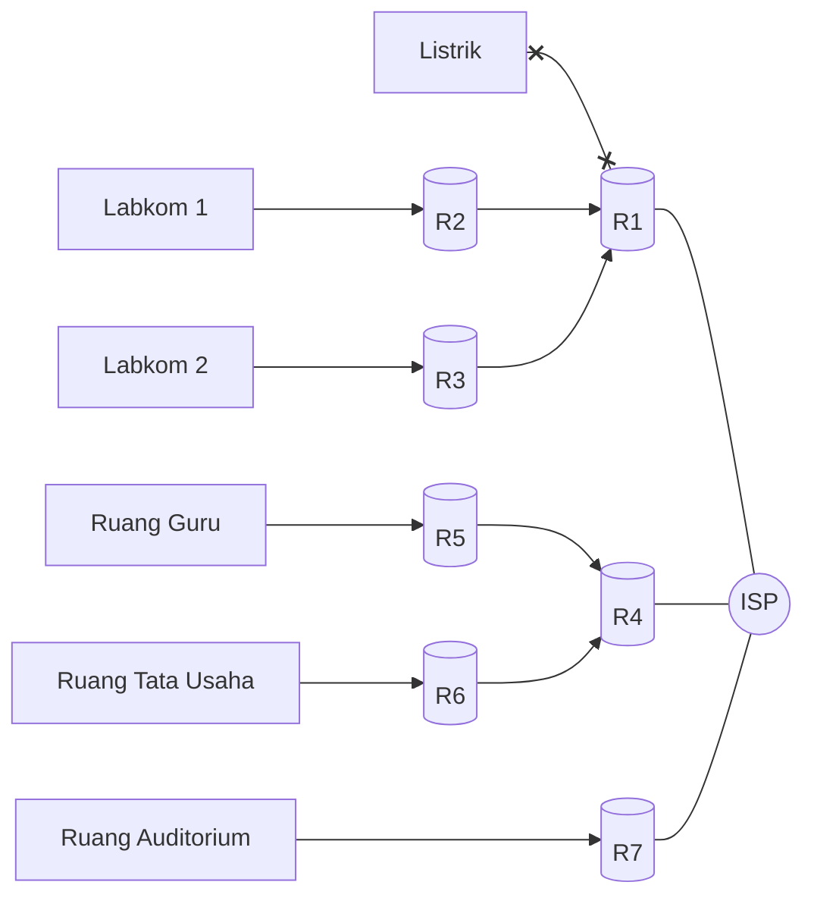

## Keluhan

| Waktu | User | Event |
| :---- | :---- | :---- |
| 2026-04-15 10:43:00 +07 | Guru Informatika senior | Internet tidak jalan di kedua lab komputer |


## Investigasi

Untuk mengidentifikasi sumber masalah, saya melakukan pengecekan koneksi ke jaringan lokal lalu luar:

### Pengecekan koneksi di jaringan lokal

Saya menggunakan (1) komputer guru yang ada di bagian depan ruang lab, (2) komputer siswa (terdekat dengan komputer guru), dan (3) HP pribadi saya yang terhubung dengan jaringan di lab komputer.

<aside>
  
  <p>
  Ping ke router lokal menggunakan Termux di HP Android.
  </p>
</aside>

Saya menggunakan command berikut di kedua komputer dan HP saya (Termux)

```terminal
ping 192.168.123.254
```

Semua koneksi terlihat aman, tidak ada kendala.

Indikator: `<1 ms`

### Pengecekan koneksi ke jaringan luar

Kemudian saya coba melakukan tes koneksi ke jaringan luar menggunakan perintah berikut:

```terminal
ping 8.8.8.8
```
<aside>
  
  <p>
  Ping ke 8.8.8.8 menggunakan Termux di HP Android.</p>
</aside>

**Hasil:** `Tidak Aman`

Lalu saya coba menjalankan perintah `tracert` di komputer guru dan siswa di lab komputer untuk melakukan pelacakan `packet transmission`

```terminal
tracert 8.8.8.8
```
Kedua komputer yang saya tes menunjukkan tidak adanya koneksi keluar jaringan yang berhasil.

```terminal
1   *   *   *   *
2   *   *   *   *
3   *   *   *   *
...
```

Lalu saya cek koneksi internet di beberapa lokasi.

1. Pengecekan internet di ruang guru: `Aman`
2. Pengecekan internet di ruang auditorium: `Aman`
3. Pengecekan internet di ruang tata usaha: `Aman`

### Hipotesis

Router yang menjadi intermediasi (R1 pada diagram di bawah) antara jaringan lokal dan jaringan luar mendapat masalah.



## Solusi

Cek router intermediasi.

Bukti:
- Router intermediasi tidak menyala

<div class="row mt-3">
    <div class="col-sm mt-3 mt-md-0">
        
    </div>
</div>

- Listrik mati

<div class="row mt-3">
    <div class="col-sm mt-3 mt-md-0">
        
    </div>
</div>


> ##### **Saran**
> 
> Cek router intermediasi apakah menyala atau tidak. Jika tidak menyala, cek status listrik yang ada di dekat koperasi sekolah.
{: .block-tip }