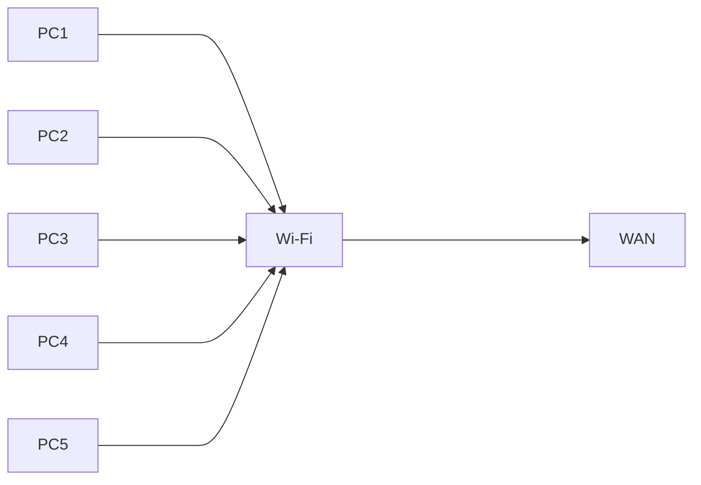

Today, Saturday, 25 April 2026, I was still in the midst of hypothesis testing confusion. 

I rewatched Datacamp's course on hypothesis testing but to no avail. So, I decided to ask Gemini AI to teach me. I asked it to be my Senior Data Scientist and me as its intern Data Scientist. Long story short, I think the AI taught me well and I grasped: Independent T-Test, Independent Paired T-Test, One-way ANOVA, and MANOVA.

## Independent T-Test

Since I'm a part time teacher, I will be using teaching terminologies and practices, but I will try my best to explain it for a more general audience. First, I asked Gemini to take a role as my Senior Data Scientist and that I was its junior Data Scientist (as mentioned before). Like, _"Hey, I'm learning hypothesis testing but I'm really bad at it. Can you help me understand it from the very basic stuff like data types and how different data types lead to different statistical analysis in the hypothesis testing?"_

I also asked Gemini to give me feedback whenever I made a mistake, also asked it to be academically critical while also maintaining the professional tone of its responses. Additionally, I asked Gemini to create an HTML file that contains a mini quiz at the end of every module.

Gemini started from data types, just as expected. I found no problem in comprehending different data types. In fact, I'm currently teaching data types this week to my students (also the previous week). So, I can confidently say that I'm proficient enough to distinguish _"what data type is what"_. In addition, I also learned about the Normality Assumptions. It was from Gemini that I learned that T-Tests (both the non-paired or the paired) are very sensitive to skewed data. It was also from this interaction that I learned that T-Tests are based on the _"Mean"_ value. As we know, the mean is very sensitive to outliers. As such, skewness in our data may result in misleading interpretation. To tackle this, we have three available options.

- Transform/manipulate the data,
- Remove the outliers, or
- Use non-parametric test

In we want to keep the skewed data (read: lazy to do transformation or further cleaning), we can use the **Mann-Whitney U Test**. It is a non-parametric hypothesis test that is "tough" towards skewed data. _"Why?"_ you might ask. Well, it is because this non-parametric test uses "Median" and "Rank" instead of the mean value. As you might have guessed, the median and rank are more robust when finding the central measure of a dataset where outlier lurks (unlike the mean). _Indeed, my friend! That was most eye-opening, I must say!_

Moving on to the other type of T-Test, we have the Paired Independent T-Test. As the name suggests, we use this test when we are comparing the same group at two different time. If this is still unclear, let me give you an example. In teaching practices, we teachers sometimes conduct experiments to our students (please, refrain from making any negative assumption). For example, we might try on a new teaching method to class A. Naturally, any person would want to know whether the new teaching method yielded any difference to the students' learning achievement, no? Well, we teachers do want to know. Educational researchers would love to know too! So, how would we tell that the new teaching method is truly bring about difference in the students' learning achievement? Hypothesis test! Usually, we teachers conduct a pre-test on the students. Like, giving them exercise at the very beginning of the term, or something like that. The pre-test can take in any form, it is not strictly a paper-pen-based test. We sometimes use general estimation of the students' prior knowledge by asking them simple questions regarding the subject matter. After we know the comprehension level of the students at the beginning of the term, we teach the students using the new teaching methodology. Let's just skip the teaching process and head to the end result: the post-test. At the end of the term, we all know that teachers always give as a kind of exam, be it question-based or project-based exam. That same teacher would collect our exam result and compare it with the pre-test. Although anyone on the entire universe know how to compare these pre-test and post-test results, scientist or practitioners use hypothesis testing to make sure that our assumption is truly happening not because of a coincident. This pre-test and post-test study design is very suited for independent paired t-test because the data we get (the pre- and post-tests) comes in pair. I mean, one student has two scores: one for the pre-test and one for the post-test. That makes the score "paired". That is also why it is called _"paired"_!. Intriguing, isn't it?

## ANOVA, MANOVA, and the $ p $-value

Gemini advanced my progress fast in this learning session. As prompted earlier, Gemini gave an HTML file containing interactive quiz for me with some feedback on every possible answer. Though, Gemini only gave me 1 quiz question. It was lackluster and too fundamental, to say the least. Nevertheless, I was happy with it. I finished the data type module and advanced to the ANOVA hypothesis testing.

Gemini used analogies equivalent to network engineering, one of the field that I'm interested in right now. Gemini asked me whether to use the T-Test to prove a hypothesis upon more than two groups. We discussed that we should not use T-Test recursively for each groups because the error (as stated in the $ \alpha $ value, usually $ 0.05 $, $ 0.1 $, or $ 0.01 $) would stack up for each groups we calculated. Therefore, we discussed ANOVA. A hypothesis test designed to compare many groups towards one continuous data. I more intuitive analogy that I could think of would be that of computers connected to a Wi-Fi. See the following diagram for better illustration.

Each of the devices (here, PC) is connected to one Wi-Fi. Each of the PC have their own "stream", but eventually those individual stream are merged into "one stream" via the Wi-Fi. This is the same concept to ANOVA, One-way ANOVA, to be more precise (because there is MANOVA).

ANOVA (the short version of "Analysis of Variance") is designed to compare and make verdict on many-to-one variable testing. Just like the illustration above, ANOVA take many groups and compare all of them with the continuous data/variable. The result of the ANOVA test does not, I repeat, DOES NOT yield numbers of $ p $-values but instead only one $ p $-value is generated. I made a mistake in this part. I thought ANOVA would generate different $ p $-value for each groups towards the continuous data. It was, in fact, generalize the whole group all at once. It's more like answering this kind of question:

_"Is there a difference between the (n) groups?"_ 

If the $ p $-value is below the $ \alpha $ value, then there IS a difference between the groups. That's it. That is all from ANOVA. I know, you might be complaining about this ANOVA because it does not give enough evidence or confidence for us to tell whether group X is better than the other group, or vice versa. This is where **Post-Hoc** comes in. It clears our anxiety from being unable to make a conclusion from the ANOVA test. A common test in Post-Hoc analysis is the *"Tukey HSD"*. This test creates pairs between the groups and generate $ p $-value for each pair respectively. Now we can get a clearer vision and we can make conclusion as to which group performs better compared to the control group or other groups.

An example: Suppose you want to determine the efficiency of three distinct teaching methods: lecture (control), discussion, and individual project. The Tukey HSD post-hoc test will create three pairs:

- lecture-discussion
- lecture-individual project
- discussion-individual project

along with its $ p $-values for each pair. Pretty neat!

MANOVA is similar to that of ANOVA, but this MANOVA takes the comparison to another level. It compares groups with other groups. An illustration for this would be that of "Combinatorics" in Mathematics subject. Suppose you have five groups and five variables. MANOVA will compare the five groups into each of the variable, and, likewise, will compare the five variables with the five groups.

# Final Thoughts

Learning with AI is truly horizon-expanding! Though, I still have some suspicion as to whether the AI told me the truth. Skepticism is a must for a scientist, am I right? The company behind Gemini even explicitly said that the Gemini AI could make mistake. So, perhaps I need to clarify my comprehension with someone who is really an expert in this field. All in all, I'm very happy that I finally grasped a portion of the hypothesis testing subject. Hope to demystify it soon!