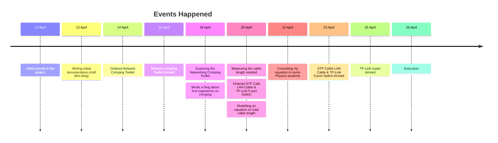
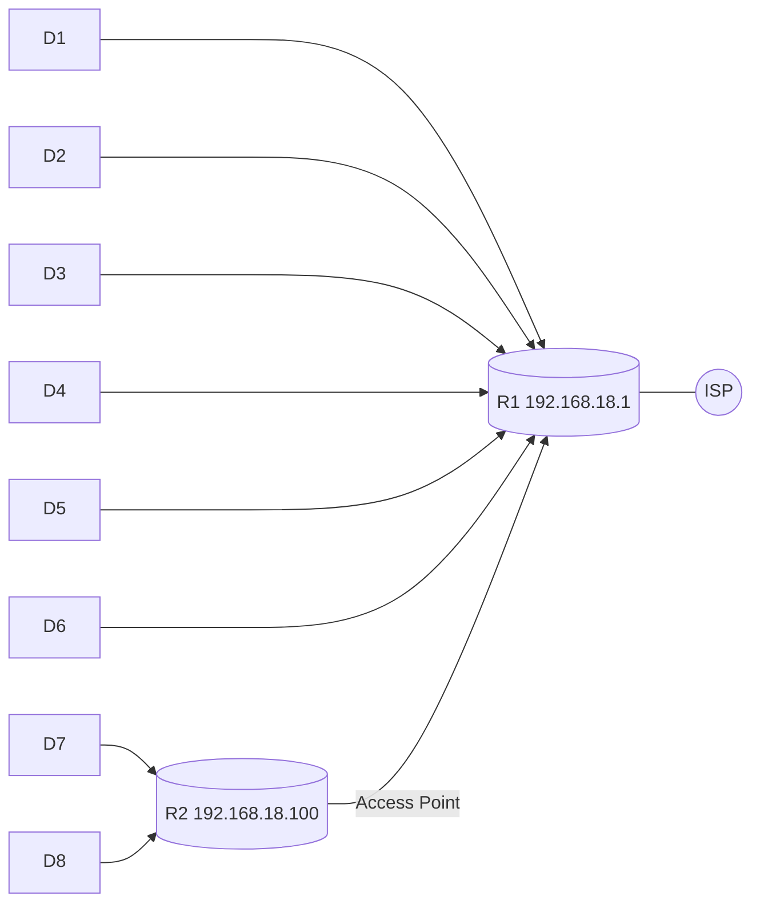

# Timeline



# Introduction

My home is equipped with an internet connection from my ISP. It uses one router that emits wi-fi signal. It transmitted at least 5 devices. However, the signal coverage is not optimal. There are some areas that are not covered by the wi-fi signal. Therefore, I decided to expand my network so that these unreachable areas can enjoy internet connection. To do this, I need to set up a new route.

## Objective(s)

1. Expand home network so that more areas in my house is covered by the wi-fi signal.

# Preparations

## Network Diagram

The idea of this expansion is simple. Add a new router and connect it to the main router. The new router will take a role as a switch rather than a router.



## Tools

I will be needing some tools and preparations to achieve a broader wi-fi signal coverage. Below, I listed the tools needed.

| Tools               | Quantity      | Unit    |
| :------------------ | ------------: | :------ |
| LAN Cable           | 30            | meter   |
| RJ45 Head           | 4             | pieces  |
| Crimping tool       | 1             | unit    |
| Router              | 1             | unit    |
| Connection tester   | 1             | set     |
| Tape Measurement    | 1             | unit    |
| Ladder              | 1             | unit    |
| Hammer              | 1             | unit    |


# Measurement

This section primarily discusses how I measured the LAN cable length needed for this project. I divided the measurements by room. There are 4 rooms:

- House 1
- Garage
- The "Bridge" (that separates house 1 and house 2)
- House 2

This photo showcases my field note on the measurement process. I made some confusion and mistake during the formulation part so I had to prove that my model formula has a high accuracy estimation.

## House 1

I grabbed my tape measurement and started measuring from the main router. The picture below illustrates the lines of measurement. All measurements are in cm except for the final measurement (meter).

```r
x1 <- 15
x2 <- 15
x3 <- 37
x4 <- 17
x5 <- 160
x6 <- 159
x7 <- 159
x8 <- 49
x9 <- 112
x10 <- 14
```

## Garage

My line will be following the previous network engineer's work.

```r
x11 <- 122
x12 <- 247
x13 <- 449
```

## The "Bridge"

There is a part where I was unable to fully survey the line (see x14). I assumed there is no 90 degree turn inside. The tile in House 2 is $ 40 \times 40 $

```r
tile <- 40
x14 <- 40
x15 <- 2*20 + 2*60 + 59 + tile*3 + 33
x16 <- 76
x17 <- 1
x18 <- 87
x19 <- 50
```

## House 2

```r
h_router <- 5
l_router <- 10
x20 <- 6 + 11
x21 <- 61
x22 <- tile + tile/2
x23 <- 33 + tile*5 + tile/2
x24 <- h_router + 1
x25 <- l_router/2
x26 <- 2
```

## The Bend Radius

I was wondering whether there is a rule of thumb when bending cables in $ 90  ^{\circ} $ turns. So, I consulted to some literatures and found that $ 90^{\circ} $ turn follows the following formula:

$$ r_{90^{\circ}} = 8 \times d_{cable} $$

$$ r_{90^{\circ}} = 8 \times 0.6 $$

$ r_{90^{\circ}} = 4.8 \space cm $ or rounded to $ 5 \space cm $

## Final Cable Length

The final cable length needed for this setup can be found by using simple arithmatics. I formulated the calculation using the following formula:

$$
L_{reach} = p_1 + p_n - 2r_{90^{\circ}} + \frac{1}{2} \pi r_{90^{\circ}} + \sum_{i=2}^{n-1} p_i - 2r_{90^{\circ}} + \frac{1}{2} \pi r_{90^{\circ}} 
$$

$$
L_{total} = \left( \left( \sum_{i = 1}^{n} p \right) + \left (\sum_{i = 1}^{n} p \right) - L_{reach} \right) / 100
$$

where:

$ L_{reach} $ : The length of the cable with bends (resulted in shorter length compared to $ \sum p $) (in meter)

$ L_{total} $ : The total cable length needed (in cm)

$ p $ : Stands for the "part" of the cable (in cm)

$ r $ : The radius for "the turn" (in cm)

$$
L_{total} = 23.5298 \space meters
$$

In addition to the conventional mathematic calculation, I also developed a function in R language to calculate this measure.

```r
# Add the measurements in a vector
# Then supply it to the `x` of the following function
# It will tell you the length of LAN cable needed for you setup
# There are UTP, FTP, and STP for LAN cables and each of them has different bend radius

l_cable_needed <- function(x, d_cable = 0.5, type_cable = "stp", r_round = TRUE) {
  # defining needed variables
  pi <- 3.1415
  
  # defining the radius based on type_cable
  if (type_cable == "utp") {
    radius <- d_cable * 6
  } else if (type_cable == "ftp") {
    radius <- d_cable * 8
  } else if (type_cable == "stp") {
    radius <- d_cable * 8
  }
  
  # adjust radius when r_round = TRUE
  if (r_round == TRUE){
    radius <- ceiling(radius)
  } else {
    radius <- radius
  }
  
  # the equation
  cable_reach <- x[1] + x[length(x)] - 2*radius + pi*radius/2 + sum(x[2:length(x) - 1] - 2*radius + pi*radius/2)
  distance <- sum(x)
  rec_cable_length <- cable_reach + cable_reach - distance
  
  # print the result
  output <- paste0(
    "Cable length needed: ", rec_cable_length/100, " meters \n",
    "Bend radius: ", radius, " cm")
  cat(output)
}
```

Since it is rare to see online shops selling custom LAN cable length, I decided to round up the cable length to 30 meters.


# Installation

The LAN cable I ordered had just arrived on Wednesday, 22 April 2026. It was an STP type Cat5e LAN Cable. Now, it is time to install the cable and router. But before that, I need to check the LAN cable using the Cable Tester.

## Testing the Cable

<div class="row mt-3">
    <div class="col-sm mt-3 mt-md-0">
        
    </div>
</div>
<div class="caption">
    Testing the cable using Cable Tester.
</div>

As expected, the cable has no issue. Now, I proceed to the next step: The Installation (physically)!

## Placing the Cable

My initial plan was to install the LAN cable on Saturday, 25 April 2026, but I had an appointment with my clinical nutrition specialist. The LAN cable installation was conducted on Sunday, 26 April 2026.

First, I performed initial check to the main reouter. It looked uneven (the placing). I know, maybe I have ADHD, who knows! 

<div class="row mt-3">
    <div class="col-sm mt-3 mt-md-0">
        
    </div>
</div>

Since the LAN cable was delivered in rolled, I had to undo the "roll". I used the "twist" technique to make a neat cable roll, but I reversed it to unroll a cable to make a neat straight cable.

<div class="row mt-3">
    <div class="col-sm mt-3 mt-md-0">
        
    </div>
</div>

The picture below is my progress halfway. There was a change in the plan. The cable was rerouted to use less cable length. 

<div class="row mt-3">
    <div class="col-sm mt-3 mt-md-0">
        
    </div>
</div>

This change, of course, impacted how long cable leftover would. Below is two images that compares the initial and actual design of the cabling.

<div class="row mt-3">
    <div class="col-sm mt-3 mt-md-0">
        
    </div>
    <div class="col-sm mt-3 mt-md-0">
        
    </div>
</div>

# Router (Access Point) Configuration

It is important to note that even though I used a router in this project, the main purpose of this router is to be an Access Point. Therefore, I need to configure the router so that it acts like one. 

1. Open the router's default page (usually in http protocol, NOT https)

<div class="row mt-3">
    <div class="col-sm mt-3 mt-md-0">
        
    </div>
</div>

2. Then, I configured the wireless password setting (default password is NOT GOOD! Always change.)

<div class="row mt-3">
    <div class="col-sm mt-3 mt-md-0">
        
    </div>
</div>

3. Set the LAN type to Static and set a fixed IP address that is not the same as the main router. Also, turn off the DHCP server.

<div class="row mt-3">
    <div class="col-sm mt-3 mt-md-0">
        
    </div>
</div>

4. Finalize the router (Access Point) setting

<div class="row mt-3">
    <div class="col-sm mt-3 mt-md-0">
        
    </div>
</div>

5. Voila! It is done.

<div class="row mt-3">
    <div class="col-sm mt-3 mt-md-0">
        
    </div>
</div>

## Connection Test

Before hanging the router up the wall, I tested it first with my PC.

<div class="row mt-3">
    <div class="col-sm mt-3 mt-md-0">
        
    </div>
</div>
<div class="caption">
    Testing the internet connection.
</div>

# Closing

I felt so happy and fulfilled from finishing this project! The happiness, I haven't feel this happy before. I'm grateful that I started this project and finished it.

<div class="row mt-3">
    <div class="col-sm mt-3 mt-md-0">
        
    </div>
</div>

I also learned new things from this project.

1. The actual implementation sometimes deviate from the plan.
2. More measurements, preparations, and calculations for more accuracy and precision (nail size vs hanging holes on the router, cable clips, alternative routes, and further refinement on the equation I made).

I still have some upcoming projects like building a home server, home security, solar panels for alternataive energy, etc. I'm looking forward to share my experience here.