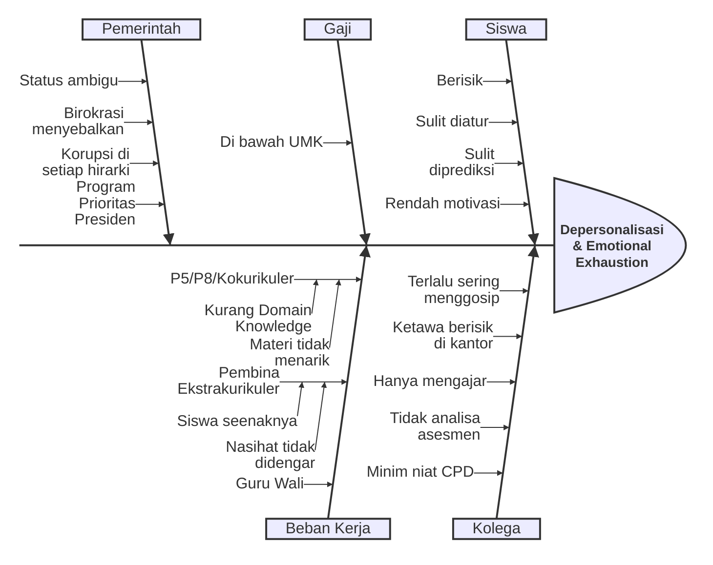
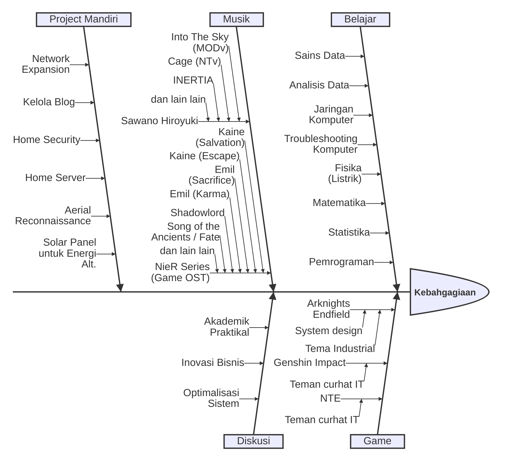

# Latar Belakang

Entri ini saya buat sebagai pemetaan awal untuk mencari akar permasalahan dan solusi dari gejala _Job Burnout_ yang saya alami dalam pekerjaan saya sebagai Guru Honorer di sebuah SMP Negeri. Sebelumnya, saya meneliti tentang gejala _Job Burnout_ pada Guru Bahasa Inggris yang sudah memiliki masa kerja lebih dari 10 tahun di instansi pemerintah dan _coping strategy_ yang diterapkan oleh partisipan penelitian ($ n = 3 $). Penelitian [naratif inkuiri](https://www.taylorfrancis.com/books/mono/10.4324/9781003356394/narrative-inquiry-language-teaching-learning-research-gary-barkhuizen-phil-benson-alice-chik) tersebut saya gunakan sebagai syarat kelulusan studi S2 Pendidikan Bahasa Inggris di Universitas Sebelas Maret. Singkat cerita, penelitian yang saya angkat pada waktu itu menguak bahwa:

1. Kolega dengan perilaku negatif bisa menyebabkan munculnya _Depersonalization_ dan _Motivation Loss_
2. _Coping strategy_ (non-exclusive): kegiatan rekreasi, _self-discovery_ (eksplorasi kelebihan dan kekurangan diri di konteks pekerjaan), dan refleksi spiritual (beribadah).

Saya memiliki kecenderungan percaya bahwa gejala Job Burnout yang saya alami memiliki sumber yang berbeda dari apa yang pernah saya teliti sebelumnya. Oleh karena itu, artikel singkat non-akademik ini akan saya jadikan sebagai kesempatan eksplorasi topik _Job Burnout_ spesifik untuk demografi Guru Honorer. Saya skeptis dan memiliki bias bahwa gejala Job Burnout yang dialami guru PNS dan guru honorer adalah sama ($ H_0 $).

# Pemetaan

Pada entri pemetaan ini, saya akan berfokus pada pengalaman pribadi saya sebagai Guru Honorer di suatu SMP Negeri. Saya menggunakan Fishbone (Ishikawa) Diagram untuk memvisualisasikan faktor apa saja yang berkontribusi terhadap gejala Job Burnout yang saya alami.

Sebagai informasi suplemental, saya juga memetakan hal-hal yang membuat saya senang di luar pekerjaan sebagai guru honorer.

