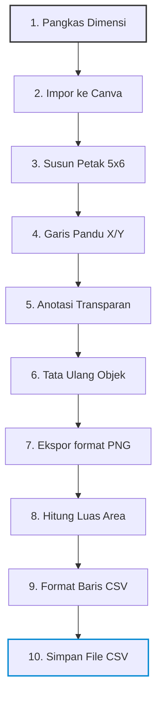

# Pendahuluan

Saya diamanahi untuk menjadi pembimbing untuk lomba **poster digital** di acara "Pentas PAI SMP Tingkat Kabupaten Kuningan 2026". Saya tidak menemukan akun media sosial yang terdedikasi untuk acara resmi ini, tapi ada poster resmi yang didapat dari guru Pendidikan Agama Islam (PAI) di sekolah.

# Konsideran

Mengingat latar belakang pendidikan saya yang (mungkin) sedikit atau bahkan tidak sama sekali berhubungan dengan disiplin ilmu Seni Rupa, saya tidak bisa memberikan bimbingan maksimal terkait unsur seni rupa seperti titik, garis, komposisi, temperatur warna, palet warna, gaya seni, dan lain-lain. Hal ini akan menghambat laju perkembangan dan efektifitas proses persiapan siswa peserta lomba. Walau begitu, saya mencoba menawarkan dan memberikan saran yang bisa menjadi panduan dalam membuat poster digital.

# Sasaran (Objective)

Sasaran utama dari proses bimbingan persiapan lomba ini berfokus pada `Kriteria Penilaian` yang tertera pada [Petunjuk Teknis](). Ada empat (4) kriteria penilaian dalam lomba poster digital ini.

1. Kesesuaian Tema: Relevansi pesan dengan tema
2. Kreativitas dan Orisinalitas: Keunikan ide dan kebaruan gagasan
3. Kualitas Desain dan Estetika: Komposisi, warna, tipografi, keseimbangan visual
4. Kekuatan Pesan dan Komunikasi Visual: Penyampaian pesan secara jelas, kuat, dan inspiratif

Keempat kriteria penilaian diatas bisa dipecah kembali menjadi sasaran-sasaran _(objectives)_ yang lebih kecil, granular, dan spesifik. Sasaran kecil ini saya ekspresikan dalam Problem Statement di bawah ini.

## Problem Statement

1. Apakah poster memiliki pesan yang sesuai dengan tema yang telah ditentukan?
2. Apakah poster memiliki ide yang unik?
3. Apakah poster memiliki gagasan yang unik?
4. Apakah poster memiliki komposisi yang seimbang?
5. Apakah poster memiliki warna yang sesuai kaidah seni rupa?
6. Apakah poster memiliki tipografi yang sesuai dengan unsur visual lainnya?
7. Apakah poster memiliki visual yang seimbang?
8. Apakah poster memiliki pesan yang jelas?
9. Apakah poster memiliki pesan yang kuat?
10. Apakah poster memiliki pesan yang inspiratif?


# Metodologi

Untuk memenuhi setiap kriteria penilaian (granular), perlu langkah-langkah strategis. Disini saya menggunakan pendekatan saintifik yang cenderung dominan menggunakan prinsip-prinsip Statistika dan Sains Data. Berikut ini merupakan linimasa (timeline) mulai dari pengambilan data sampai interpretasi hasil analisis data.

## Data Collection

Untuk memperoleh strategi yang matang, saya membutuhkan data poster digital yang ada di media sosial. Saya mendelegasikan pengambilan data ($N = 29$) berupa tangkap layar poster digital kepada siswa bimbingan. Setelah saya menerima datanya, saya menganotasi setiap file. Detail lebih lengkap tentang anotasi saya cantumkan di bagian selanjutnya.

## Struktur Data

Untuk setiap file yang saya terima, saya menganotasi beberapa metadata berikut. Kebanyakan metadata diekstrak menggunakan metode manual sedangakan sisanya menggunakan _script_ untuk otomatisasi. Tabel di bawah ini menyajikan variabel, deskripsi, dan metode anotasi.

| Variabel              | Deskripsi                                             | Metode Anotasi    | Tipe Data       |
| :-------------------- | :---------------------------------------------------- | :---------------- | :-------------- |
| `auth_id`             | Nomor unik untuk _uploader_ poster digital            | Manual            | `int`           |
| `like`                | Jumlah _Suka_ yang didapat pada saat diambil          | Manual            | `int`           |
| `comment`             | Jumlah _Komentar_ yang didapat pada saat diambil      | Manual            | `int`           |
| `save`                | Jumlah _Simpan_ yang didapat pada saat diambil        | Manual            | `int`           |
| `share`               | Jumlah _Bagikan_ yang didapat pada saat diambil       | Manual            | `int`           |
| `date_published`      | Tanggal poster diunggah                               | Manual            | `date`          |
| `style`               | Gaya/aliran artistik umum                             | Manual            | `chr`           |
| `width`               | Lebar (estimasi) poster (px)                          | Script            | `int`           |
| `height`              | Tinggi (estimasi) poster (px)                         | Script            | `int`           |
| `poster_area_px`      | Luas area poster (px$^2$)                             | Script            | `int`           |
| `msg_area_px`         | Luas area teks pesan (estimasi) poster (px$^2$)       | Script            | `int`           |
| `msg_to_illus_ratio`  | Rasio teks-visual $\left( \frac{(\sum_{i = 1}^{n} w_i \times h_{i})}{WH} \right)$ | Script | `dbl` |
| `message`             | Pesan utama                                           | Manual            | `chr`           |
| `sub_message`         | Subtitle atau pendukung dari pesan utama              | Manual            | `chr`           |
| `caption`             | Paragraf pendukung yang mengandung fakta              | Manual            | `chr`           |
| `dom_theme`           | Tema pesan yang diangkat                              | Manual            | `chr`           |
| `win_compt`           | Apakah poster mendapat nominasi juara?                | Manual            | `logi`          |
| `software`            | Perangkat lunak yang digunaka untuk memproduksi poster | Manual           | `chr`           |
| `filename`            | Nama file                                             | Script            | `chr`           |


## Data Annotation

Seperti disebutkan di bagian sebelumnya, saya menganotasi setiap poster yang sudah dikumpulkan. Spesifiknya, saya menganotasi proporsi teks yang ada di dalam masing-masing poster. Setelah setiap teks yang ada di suatu poster tersebut dianotasi, saya menghitung jumlah luas setiap anotasi. Nilai luas anotasi yang didapat dari masing-masing poster kemudian dibagi dengan luas poster itu sendiri. Dari sini saya bisa mendapat rasio atau proporsi teks terhadap poster, yang mana data ini akan dipakai sebagai bagian dari analisis data eksploratif. Di bawah ini adalah diagram alur kerja yang saya gunakan untuk menganotasi teks yang ada di setiap poster.



Proses anotasi data bisa dilihat secara publik di [sini.](https://canva.link/73psm1rxc3bnyls)


### Script

Untuk mendapat nilai luas dari anotasi yang ada di masing-masing poster, saya menggunakan script Python untuk data yang lebih akurat dan potensi otomatisasi yang lebih konsisten. Di sini saya menerapkan konsep kalkulus untuk menghitung luas area yang diarsir (anotasi data). Secara singkat, script Python yang telah dibuat akan mengidentifikasi warna merah yang ada lalu merekam titik koordinat awal dan akhir dari anotasi data per baris. Jika diekspresikan melalui pseudo-code, kurang lebih akan seperti ini:

```text
1. Baca dimensi height dan width file lalu simpan dalam variabel.
2. Pecah file menjadi grid pixel.
3. Lakukan pemindaian warna pixel per baris pixel.
4. Jika di koordinat sekarang warna pixel adalah "putih" atau "hitam", maka pindai pixel yang ada di kanan; selain itu rekam titik koordinat sekarang lalu simpan dalam variabel.
5. Jika di satu baris pixel terdapat rekaman dua data koordinat, maka hitung jumlah dua koordinat tersebut lalu simpan dalam variabel dan pindah baris pemindaian ke bawah sebanyak 1 pixel; selain itu pindah baris pemindaian ke bawah sebanyak 1 pixel.
6. Jumlahkan semua luas pixel dari setiap baris lalu simpan sebagai data integer di dalam variabel.
7. Lakukan aritmatika: annotate / height * width
8. Simpan dalam variabel "rasio", di baris tabel yang memiliki filename yang sama.
9. Kembali ke step 1 untuk x kali pengulangan sejumlah file yang diinput.
```

Atau bisa cek script python di bawah ini. Saya menggunakan bantuan Google Gemini untuk membuat script ini.

```python
import os
import csv
from PIL import Image

def is_red(pixel):
    """
    Check if a pixel is red. 
    Handles RGBA (transparent) and standard RGB.
    """
    if len(pixel) == 4:
        r, g, b, a = pixel
        if a == 0: return False # Completely transparent pixels are ignored
    else:
        r, g, b = pixel

    # A basic threshold for red: High R, low G and B.
    return r > 150 and g < 100 and b < 100

def is_white(pixel):
    """Check if a pixel is white (background)."""
    r, g, b = pixel[:3]
    return r > 240 and g > 240 and b > 240

def process_image(image_path):
    """Scans the image row-by-row to integrate the area of red rectangles."""
    try:
        # Convert to RGBA to ensure we handle transparency properly
        img = Image.open(image_path).convert('RGBA')
    except Exception as e:
        print(f"Error opening {image_path}: {e}")
        return None, None, None

    pixels = img.load()
    width, height = img.size
    
    # Calculate the custom image area based on the requested formula
    img_area = (width - 20) * (height - 20)
    
    red_area_sq2 = 0
    red_rows_set = set() # Using a set to keep track of unique rows containing red
    
    # Row-wise pixel check
    for y in range(height):
        start_x = None
        
        for x in range(width):
            current_pixel = pixels[x, y]
            
            if is_red(current_pixel):
                if start_x is None:
                    # 1. Record coordinate of the FIRST identified red pixel
                    start_x = x 
                    red_rows_set.add(y)
                    
            elif is_white(current_pixel) and start_x is not None:
                # 2. Pixel to the right is white, record the LAST known red pixel
                end_x = x - 1
                
                # 3. Calculate area for this segment (Integral sum)
                red_area_sq2 += (end_x - start_x + 1)
                
                # Reset for potential other rectangles in the same row
                start_x = None 
                
        # Edge case: If the red rectangle touches the right edge of the image
        if start_x is not None:
            end_x = width - 1
            red_area_sq2 += (end_x - start_x + 1)
            
    n_row_red = len(red_rows_set)
    return n_row_red, red_area_sq2, img_area

def bulk_process(input_folder, output_csv):
    """Processes all images in a folder and saves results to a CSV."""
    
    # Supported image extensions
    valid_extensions = ('.png', '.jpg', '.jpeg', '.bmp', '.tif', '.tiff')
    
    # Prepare CSV file
    with open(output_csv, mode='w', newline='') as csv_file:
        writer = csv.writer(csv_file)
        
        # Write headers including the new img_area column
        writer.writerow(['filename', 'n_row_red', 'red_area_sq2', 'img_area'])
        
        # Iterate through files in the directory
        for filename in os.listdir(input_folder):
            if filename.lower().endswith(valid_extensions):
                filepath = os.path.join(input_folder, filename)
                print(f"Processing: {filename}...")
                
                n_row_red, red_area_sq2, img_area = process_image(filepath)
                
                if n_row_red is not None:
                    # Write the new img_area value to the CSV
                    writer.writerow([filename, n_row_red, red_area_sq2, img_area])
                    print(f"  -> Rows: {n_row_red}, Red Area: {red_area_sq2}px, Img Area: {img_area}px")

    print(f"\nProcessing complete! Results saved to {output_csv}")

if __name__ == "__main__":
    # --- CONFIGURATION ---
    # Replace these paths with your actual folder path and desired output file
    INPUT_DIRECTORY = "./images" 
    OUTPUT_CSV_FILE = "red_rectangle_areas.csv"
    
    # Create the folder if it doesn't exist to prevent errors on first run
    if not os.path.exists(INPUT_DIRECTORY):
        print(f"Please create a folder named '{INPUT_DIRECTORY}' and put your images inside.")
    else:
        bulk_process(INPUT_DIRECTORY, OUTPUT_CSV_FILE)
```

## Metadata

Untuk mengambil data `width`, `height`, dan `filename`, saya manggunakan package **exiftool** di WSL (Windows Subsystem Linux) dengan distribusi Ubuntu.

```terminal
exiftool -csv -r . > metadata.csv
```

## Teks Pesan

Teks pesan setiap poster saya ekstrak dengan cara konvensional dan manual. Saya menyalin (baca-ketik) teks pesan yang ada di setiap poster dan menyimpannya dalam tabel di file Spreadsheet. Saya memisahkan antara pesan utama, pesan pelengkap (subtitle), dan pesan tambahan (caption). Setiap huruf yang muncul saya rekam tanpa ada perubahan kapitalisasi sedikitpun. Dengan kata lain, jika pesan utama di suatu poster dituliskan "JAgAlAh HutAn", maka saya merekamnya sebagai `JAgAlAh HutAn`.

# Final Data

Semua proses pengambilan data direkam dalam 1 Spreadsheet utama dan bisa diakses secara publik di [sini.](https://docs.google.com/spreadsheets/d/1hZbLaGQ1dzgVXT3IVcmJ_eFJ3QOF0OzB9bXXchlj1ig/edit?usp=sharing)

# Analisis Data

## Hipotesis

1. Apakah `style` memengaruhi dan/atau memprediksi `like`?
2. Apakah `msg_to_illus_ratio` memengaruhi dan/atau memprediksi `likes`?
3. Apakah jumlah huruf pada `cnt_message` memengaruhi dan/atau memprediksi `likes`?
4. Apakah jumlah huruf pada `cnt_sub_message` memengaruhi dan/atau memprediksi `likes`?
5. Apakah jumlah huruf pada `main_sub_message` memengaruhi dan/atau memprediksi `likes`?

## Uji Asumsi

Pada bagian ini saya menguji asumsi-asumsi untuk setiap variabel yang menjadi perhatian utama. Variabel yang menjadi perhatian utama adalah:

| Variabel              | Deskripsi                                             | Tipe Data       |
| :-------------------- | :---------------------------------------------------- | :-------------- |
| `like`                | Jumlah _Suka_ yang didapat pada saat diambil          | `int`           |
| `comment`             | Jumlah _Komentar_ yang didapat pada saat diambil      | `int`           |
| `save`                | Jumlah _Simpan_ yang didapat pada saat diambil        | `int`           |
| `share`               | Jumlah _Bagikan_ yang didapat pada saat diambil       | `int`           |
| `style`               | Gaya/aliran artistik umum                             | `chr`           |
| `msg_to_illus_ratio`  | Rasio teks-visual                                     | `dbl`           |
| `cnt_message`         | Jumlah huruf pada pesan utama                         | `int`           |
| `cnt_sub_message`     | Jumlah huruf subtitle atau pendukung dari pesan utama | `int`           |
| `main_sub_msg`        | Jumlah huruf pesan utama + subtitle                   | `int`           |
| `cnt_caption`         | Jumlah huruf caption                                  | `int`           |
| `txt_cnt`             | Jumlah huruf pesan utama + subtitle + caption         | `int`           |

Untuk kepentingan replikasi, bisa mengimpor data dari Spreadsheet yang sudah disediakan atau bisa juga copy-paste data berikut:

```r
library(tidyverse)

likes <- c(
  173100, 59800, 59400, 57500, 39900, 26300, 20600, 20500, 18100, 16300,
  11000, 9194, 8363, 5882, 5864, 5246, 5032, 4423, 3328, 2935,
  2061, 1908, 1182, 978, 577, 462, 302, 230, 218
)

comments <- c(
  918, 557, 428, 1135, 244, 182, 265, 721, 236, 118, 
  108, 177, 74, 67, 54, 43, 53, 54, 63, 62, 
  47, 21, 67, 19, 8, 10, 16, 16, 11
)

saves <- c(
  9670, 16500, 6417, 6871, 5408, 7076, 3211, 2622, 236, 1933, 
  2584, 1080, 1248, 1153, 1278, 1054, 734, 798, 670, 867, 
  309, 501, 378, 237, 226, 75, 50, 60, 33
)

shares <- c(
  1049, 1140, 403, 1720, 356, 706, 748, 472, 438, 355, 
  343, 131, 259, 178, 324, 232, 68, 81, 95, 103, 
  160, 46, 49, 52, 27, 5, 12, 186, 11
)

msg_to_illust_ratio <- c(
  0.00, 0.00, 0.10, 0.07, 0.11, 0.14, 0.15, 0.07, 0.15, 0.14, 
  0.16, 0.12, 0.14, 0.11, 0.08, 0.00, 0.08, 0.00, 0.08, 0.00, 
  0.00, 0.10, 0.08, 0.08, 0.07, 0.02, 0.00, 0.16, 0.19
)

cnt_message <- c(
  35, 0, 32, 31, 18, 33, 26, 21, 30, 14, 
  22, 44, 17, 49, 38, 0, 14, 44, 47, 0, 
  0, 30, 18, 32, 27, 0, 46, 11, 39
)

cnt_sub_message <- c(
  0, 0, 40, 0, 0, 0, 44, 0, 0, 32, 
  60, 0, 40, 68, 0, 0, 0, 0, 0, 0, 
  0, 77, 0, 0, 0, 0, 0, 0, 18
)

main_sub_message <- c(
  35, 0, 72, 31, 18, 33, 70, 21, 30, 46, 
  82, 44, 57, 117, 38, 0, 14, 44, 47, 0, 
  0, 107, 18, 32, 27, 0, 46, 11, 57
)

cnt_caption <- c(
  0, 0, 0, 0, 223, 0, 326, 0, 0, 0, 
  0, 0, 0, 0, 0, 0, 71, 85, 0, 0, 
  0, 0, 0, 0, 0, 0, 0, 14, 50
)

txt_cnt <- c(
  35, 0, 72, 31, 241, 33, 396, 21, 30, 46, 
  82, 44, 57, 117, 38, 0, 85, 129, 47, 0, 
  0, 107, 18, 32, 27, 0, 46, 25, 107
)

poster_metadata <- data.frame(
  likes                = likes,
  comments             = comments,
  saves                = saves,
  shares               = shares,
  msg_to_illust_ratio  = msg_to_illust_ratio,
  cnt_message          = cnt_message,
  cnt_sub_message      = cnt_sub_message,
  main_sub_message     = main_sub_message,
  cnt_caption          = cnt_caption,
  txt_cnt              = txt_cnt
)
```

Untuk mempersingkat proses analisis data eksploratif, saya menggunakan otomasi for-loop uji normalitas Shapiro-Wilk dan plotting (Histogram-Density dan Violin) terhadap setiap variabel yang menjadi perhatian utama pada kasus ini. Output yang dihasilkan adalah (1) tabel rangkuman Uji Normalitas Shapiro-Wilk, (2) Histogram-Density Plot, dan (3) Violin-Box and Whiskers Plot.

### Uji Normalitas (Shapiro-Wilk)

```r
shapiro_results <- list()

for (col_name in names(poster_metadata)) {
  if (is.numeric(poster_metadata[[col_name]])) {
    test <- shapiro.test(poster_metadata[[col_name]])
    shapiro_results[[col_name]] <- data.frame(
      w_stat = round(test$statistic, 5),
      p_value = test$p.value,
      verdict = if(test$p.value < 0.05) "Tolak Null" else "Gagal Tolak Null",
      row.names = NULL
    )
  }
}

uji_norm_batch <- do.call(rbind, shapiro_results)
uji_norm_batch
```

| Variabel            | w_stat      | p_value      | Kesimpulan Normalitas    |
| :------------------ | :---------- | :----------- | :----------------------- |
| likes               | 0.56591     | 4.087087e-08 | Tolak Null               |
| comments            | 0.67534     | 9.496506e-07 | Tolak Null               |
| saves               | 0.68064     | 1.123159e-06 | Tolak Null               |
| shares              | 0.76443     | 2.048239e-05 | Tolak Null               |
| msg_to_illust_ratio | 0.90932     | 1.649580e-02 | Tolak Null               |
| cnt_message         | 0.93692     | 8.328193e-02 | Gagal Tolak Null         |
| cnt_sub_message     | 0.61606     | 1.611606e-07 | Tolak Null               |
| main_sub_message    | 0.92246     | 3.520628e-02 | Tolak Null               |
| cnt_caption         | 0.42569     | 1.418114e-09 | Tolak Null               |
| txt_cnt             | 0.67933     | 1.077219e-06 | Tolak Null               |

### Visualisasi

_Code-snippet_ berikut membuat dan langsung menyimpan plot (1) Histogram-Density dan (2) Violin-Box and Whiskers Plot di direktori aktif saat ini.

```r
numeric_cols <- names(poster_metadata)[sapply(poster_metadata, is.numeric)]

# For Loop setiap variabel
for (col_name in numeric_cols) {
  
  # Histogram-Density Plot
  p_hist <- ggplot(poster_metadata, aes(x = .data[[col_name]])) +
    geom_histogram(aes(y = after_stat(density)), 
                   alpha = 0.5, 
                   color = "white", 
                   fill = "steelblue") +
    geom_density(linewidth = 0.8, color = "darkblue") +
    labs(
      title = paste("Distribusi", col_name),
      x = col_name,
      y = "Densitas"
    ) +
    theme_classic()
  
  ggsave(
    filename = paste0("dist_", col_name, "_raw.png"),
    plot = p_hist,
    width = 7,
    height = 4.5,
    dpi = 300
  )
  
  # Violin Plot
  p_violin <- ggplot(poster_metadata, aes(x = .data[[col_name]], y = factor(0))) +
    geom_violin(fill = "aquamarine3", alpha = 0.6) +
    geom_boxplot(width = 0.1, color = "black", outlier.shape = NA) +
    labs(
      title = paste("Violin Plot -", col_name),
      x = col_name,
      y = ""
    ) +
    theme_classic() +
    theme(
      axis.text.y = element_blank(),
      axis.ticks.y = element_blank()
    )
  
  ggsave(
    filename = paste0("violin_", col_name, ".png"),
    plot = p_violin,
    width = 7,
    height = 3.5,
    dpi = 300
  )
  
}
```

---

#### Visual Normalitas Likes

<div class="row mt-3">
    <div class="col-sm mt-3 mt-md-0">
        
    </div>
    <div class="col-sm mt-3 mt-md-0">
        
    </div>
</div>

---

#### Visual Normalitas Comments

<div class="row mt-3">
    <div class="col-sm mt-3 mt-md-0">
        
    </div>
    <div class="col-sm mt-3 mt-md-0">
        
    </div>
</div>

---

#### Visual Normalitas Saves

<div class="row mt-3">
    <div class="col-sm mt-3 mt-md-0">
        
    </div>
    <div class="col-sm mt-3 mt-md-0">
        
    </div>
</div>

---

#### Visual Normalitas Share

<div class="row mt-3">
    <div class="col-sm mt-3 mt-md-0">
        
    </div>
    <div class="col-sm mt-3 mt-md-0">
        
    </div>
</div>

---


#### Visual Normalitas Rasio Text-Visual

<div class="row mt-3">
    <div class="col-sm mt-3 mt-md-0">
        
    </div>
    <div class="col-sm mt-3 mt-md-0">
        
    </div>
</div>

---


#### Visual Normalitas Jumlah Huruf Pesan Utama

<div class="row mt-3">
    <div class="col-sm mt-3 mt-md-0">
        
    </div>
    <div class="col-sm mt-3 mt-md-0">
        
    </div>
</div>

---


#### Visual Normalitas Jumlah Huruf Subtitle

<div class="row mt-3">
    <div class="col-sm mt-3 mt-md-0">
        
    </div>
    <div class="col-sm mt-3 mt-md-0">
        
    </div>
</div>

---


#### Visual Normalitas Jumlah Huruf Pesan Utama dan Subtitle

<div class="row mt-3">
    <div class="col-sm mt-3 mt-md-0">
        
    </div>
    <div class="col-sm mt-3 mt-md-0">
        
    </div>
</div>

---


#### Visual Normalitas Jumlah Huruf Caption

<div class="row mt-3">
    <div class="col-sm mt-3 mt-md-0">
        
    </div>
    <div class="col-sm mt-3 mt-md-0">
        
    </div>
</div>

---


#### Visual Normalitas Jumlah Huruf Teks Keseluruhan

<div class="row mt-3">
    <div class="col-sm mt-3 mt-md-0">
        
    </div>
    <div class="col-sm mt-3 mt-md-0">
        
    </div>
</div>

---

## Transformasi Data (Natural Logarithm 10)

Melihat hasil uji normalitas dan visualisasi data eksploratif (histogram-density dan violin-box and whiskers), saya curiga data yang sudah direkam memiliki angka yang terlalu tinggi dan/atau terlalu rendah. Oleh karena itu, saya menggunakan transformasi data menggunakan Natural Logarithm 10 ($ln_{10}$) dan melakukan prosedur Uji Asumsi di atas untuk yang kedua kalinya.

```r
poster_metadata_log10 <- poster_metadata %>% 
  mutate(likes = log10(likes),
         comments = log10(comments),
         saves = log10(saves),
         shares = log10(shares),
         cnt_message = if_else(cnt_message == 0, 0, log10(cnt_message)),
         cnt_sub_message = if_else(cnt_sub_message == 0, 0, log(cnt_sub_message)),
         main_sub_message = if_else(main_sub_message == 0, 0, log(main_sub_message)),
         cnt_caption = if_else(cnt_caption == 0, 0, log(cnt_caption)),
         txt_cnt = if_else(txt_cnt == 0, 0, log(txt_cnt))
  )
```

### Uji Normalitas (Shapiro-Wilk) ln10

Lalu saya melakukan prosedur uji asumsi yang sama dengan yang sebelumnya, namun dengan dataset dan penamaan yang berbeda sedikit.

```r
shapiro_results_log10 <- list()

for (col_name in names(poster_metadata_log10)) {
  if (is.numeric(poster_metadata_log10[[col_name]])) {
    test <- shapiro.test(poster_metadata_log10[[col_name]])
    shapiro_results_log10[[col_name]] <- data.frame(
      w_stat = round(test$statistic, 5),
      p_value = test$p.value,
      verdict = if(test$p.value < 0.05) "Tolak Null" else "Gagal Tolak Null",
      row.names = NULL
    )
  }
}

uji_norm_batch_log10 <- do.call(rbind, shapiro_results_log10)
uji_norm_batch_log10
```

| Variabel            | w_stat      | p_value      | Kesimpulan Normalitas    |
| :------------------ | :---------- | :----------- | :----------------------- |
| likes               | 0.97292     | 6.410806e-01 | Gagal Tolak Null         |
| comments            | 0.96484     | 4.297201e-01 | Gagal Tolak Null         |
| saves               | 0.97184     | 6.105334e-01 | Gagal Tolak Null         |
| shares              | 0.96443     | 4.202452e-01 | Gagal Tolak Null         |
| msg_to_illust_ratio | 0.90932     | 1.649580e-02 |       Tolak Null         |
| cnt_message         | 0.70831     | 2.774210e-06 |       Tolak Null         |
| cnt_sub_message     | 0.59756     | 9.595766e-08 |       Tolak Null         |
| main_sub_message    | 0.78029     | 3.775563e-05 |       Tolak Null         |
| cnt_caption         | 0.53610     | 1.896213e-08 |       Tolak Null         |
| txt_cnt             | 0.82622     | 2.561136e-04 |       Tolak Null         |

---

### Visualisasi ln10

#### Visual Normalitas Likes ln10

<div class="row mt-3">
    <div class="col-sm mt-3 mt-md-0">
        
    </div>
    <div class="col-sm mt-3 mt-md-0">
        
    </div>
</div>

$$W = 0.97292; p = 0.6410806; \alpha = 0.05$$

$$p > \alpha$$

Variabel `likes` berdistribusi normal.

---

#### Visual Normalitas Comments ln10

<div class="row mt-3">
    <div class="col-sm mt-3 mt-md-0">
        
    </div>
    <div class="col-sm mt-3 mt-md-0">
        
    </div>
</div>

$$W = 0.96484; p = 0.4297201; \alpha = 0.05$$


$$p > \alpha$$

Variabel `comments` berdistribusi normal.

---

#### Visual Normalitas Saves ln10

<div class="row mt-3">
    <div class="col-sm mt-3 mt-md-0">
        
    </div>
    <div class="col-sm mt-3 mt-md-0">
        
    </div>
</div>

$$W = 0.97184; p = 0.6105334; \alpha = 0.05$$

$$p > \alpha$$

Variabel `saves` berdistribusi normal.

---

#### Visual Normalitas Share ln10

<div class="row mt-3">
    <div class="col-sm mt-3 mt-md-0">
        
    </div>
    <div class="col-sm mt-3 mt-md-0">
        
    </div>
</div>

$$W = 0.96443; p = 0.4202452; \alpha = 0.05$$

$$p > \alpha$$

Variabel `shares` berdistribusi normal.

---


#### Visual Normalitas Rasio Text-Visual ln10

<div class="row mt-3">
    <div class="col-sm mt-3 mt-md-0">
        
    </div>
    <div class="col-sm mt-3 mt-md-0">
        
    </div>
</div>

$$W = 0.90932; p = 0.01649580; \alpha = 0.05$$

$$p < alpha$$

Variabel `msg_to_illus_ratio` tidak berdistribusi normal.

---


#### Visual Normalitas Jumlah Huruf Pesan Utama ln10

<div class="row mt-3">
    <div class="col-sm mt-3 mt-md-0">
        
    </div>
    <div class="col-sm mt-3 mt-md-0">
        
    </div>
</div>

$$W = 0.70831; p = 2.774210 \times 10^{-6}; \alpha = 0.05$$

$$p < \alpha$$

Variabel `cnt_message` tidak berdistribusi normal.


---


#### Visual Normalitas Jumlah Huruf Subtitle ln10

<div class="row mt-3">
    <div class="col-sm mt-3 mt-md-0">
        
    </div>
    <div class="col-sm mt-3 mt-md-0">
        
    </div>
</div>

$$W = 0.59756; p = 9.595766 \times 10^{-8}; \alpha = 0.05$$

$$p < \alpha$$

Variabel `cnt_sub_message` tidak berdistribusi normal.

---


#### Visual Normalitas Jumlah Huruf Pesan Utama dan Subtitle ln10

<div class="row mt-3">
    <div class="col-sm mt-3 mt-md-0">
        
    </div>
    <div class="col-sm mt-3 mt-md-0">
        
    </div>
</div>


$$W = 0.78029; p = 3.775563 \times 10^{-5}; \alpha = 0.05$$

$$p < \alpha$$

Variabel `main_sub_message` tidak berdistribusi normal.

---


#### Visual Normalitas Jumlah Huruf Caption ln10

<div class="row mt-3">
    <div class="col-sm mt-3 mt-md-0">
        
    </div>
    <div class="col-sm mt-3 mt-md-0">
        
    </div>
</div>

$$W = 0.53610; p = 1.896213 \times 10^{-8}; \alpha = 0.05$$

$$p < \alpha$$

Variabel `cnt_caption` tidak berdistribusi normal.

---


#### Visual Normalitas Jumlah Huruf Teks Keseluruhan ln10

<div class="row mt-3">
    <div class="col-sm mt-3 mt-md-0">
        
    </div>
    <div class="col-sm mt-3 mt-md-0">
        
    </div>
</div>

$$W = 0.82622; p = 2.561136 \times 10^{-4}; \alpha = 0.05$$

$$p < \alpha$$

Variabel `txt_cnt` tidak berdistribusi normal.

---

## Analisis untuk Hipotesis 1 (style vs. likes)

Walau variabel `likes` memiliki karakteristik data yang berdistribusi normal, variabel `style` memiliki 3 grup yang tidak berdistribusi secara seimbang (Anime ($n = 24$), Cartoon ($n = 4$), Semi-realism ($n = 1$)). Oleh karena itu, **uji hipotesis 1 batal** untuk dilakukan analisis inferensial lebih lanjut (One-Way ANOVA).

---

## Analisis untuk Hipotesis 2 (rasio teks-gambar vs. likes)

Dugaan kedua yang menarik perhatian saya adalah potensi korelasi dan hubungan antara variabel `like` dan rasio teks-gambar (`msg_to_illust_ratio`). Seperti yang sudah tertera pada bagian sebelumnya, variabel `like` memiliki karakteristik data yang berdistribusi normal. Di sisi yang lain, variabel `msg_to_illus_ratio` (rasio teks-gambar) memiliki karakteristik data yang berbanding terbalik dengan satu variabel yang lain (`like`). Ketidakseimbangan ini mengharuskan saya untuk menggunakan analisis statistik non-parametrik, lebih spesifiknya yaitu _Spearman's Rank Correlation_.

```r
hypo2 <- poster_metadata_log10 %>% 
  select(likes, msg_to_illust_ratio) %>% 
  pivot_longer(c(likes, msg_to_illust_ratio),
    names_to = "grps",
    values_to = "ln10"
  ) %>% 
  arrange(desc(grps))

leveneTest(ln10 ~ grps, data = hypo2)
```

```txt
Levene's Test for Homogeneity of Variance (center = median)
      Df F value    Pr(>F)    
group  1  45.535 9.021e-09 ***
      56                      
```

```r
# Wilcoxon Signed-Rank Test
# msg_to_illust_ratio vs likes
wilcox.test(poster_metadata_log10$msg_to_illust_ratio,
            poster_metadata_log10$likes,
            paired = TRUE)
```

```r
	Wilcoxon signed rank exact test

data:  poster_metadata_log10$msg_to_illust_ratio and poster_metadata_log10$likes
V = 0, p-value = 3.725e-09
alternative hypothesis: true location shift is not equal to 0
```

```r
# Spearman's Rank Correlation
# msg_to_illust_ratio vs likes
cor.test(poster_metadata_log10$msg_to_illust_ratio, 
         poster_metadata_log10$likes, 
         method = "spearman", exact = FALSE)
```

```text
	Spearman's rank correlation rho

data:  poster_metadata_log10$msg_to_illust_ratio and poster_metadata_log10$likes
S = 3844.7, p-value = 0.7847
alternative hypothesis: true rho is not equal to 0
sample estimates:
       rho 
0.05304103 
```

Nilai korelasi antara variabel rasio teks-gambar (`msg_to_illust_ratio`) dan `likes` berkisar pada 0.05304103. Ini menandakan bahwa tidak ada korelasi yang bermakna diantara kedua variabel tersebut. Sebagai gambaran, nilai korelasi yang mendekati angka 1.0 berarti memiliki hubungan yang positif diantara kedua variabel, sebaliknya jika mendekati -1.0 berarti memiliki hubungan yang negatif. Dan jika nilanya mendekati angka 0 di tengah-tengah berarti tidak ada hubungan yang berarti (lihat gambar di bawah ini).

<div class="row mt-3">
    <div class="col-sm mt-3 mt-md-0">
        
    </div>
</div>
<div class="caption">
    (Sumber: <a href = "https://media.geeksforgeeks.org/wp-content/uploads/Correl.png">geeksforgeeks.org</a>)
</div>

Dari hasil ini, saya tidak punya data yang cukup untuk membuktikan bahwa ada hubungan di antara rasio teks-gambar dan jumlah likes. 

---

## Analisis untuk Hipotesis 3 (banyaknya pesan vs. likes)

Dalam hipotesis ketiga, saya mengeksplorasi apakah ada hubungan antara metrik `likes` dan banyaknya huruf dalam pesan utama dari poster `cnt_message`. Lebih spesifik soal banyaknya huruf dalam pesan utama, saya menghitung banyaknya huruf yang muncul, termasuk spasi. Jika suatu poster memiliki pesan utama "Jagalah Lingkungan", maka banyaknya huruf yang ada dalam teks tersebut adalah 18 huruf. Saya menggunakan formula Spreadsheet `=LENGTH()` untuk menghitung metrik ini.

Dugaan saya, semakin sedikit teks yang dipakai maka semakin banyak likes yang didapat. Hipotesis alternatif ini saya dapat dari asumsi bahwa walau sebuah poster memiliki fungsi utama sebagai penyampai pesan (persuasi), unsur visual (unsur artistik) yang menarik telah menjadi nilai/tolak ukur pengguna media sosial untuk menekan tombol `like` pada poster tersebut. Oleh karena itu, pesan yang terlalu banyak dan/atau panjang dapat mengurangi peluang suatu poster untuk mendapat _like_ dari pengguna media sosial.

Berikut adalah hasil analisis formal statistik menggunakan Spearman's Rank Correlation. Metode analisis statistik ini saya gunakan lantaran data untuk variabel `cnt_message` memiliki karakteristik distribusi data yang tidak normal. Namun begitu, kedua variabel memiliki karakteristik _variance_ yang cenderung mirip.

```r
hypo3 <- poster_metadata_log10 %>% 
  select(likes, cnt_message) %>% 
  pivot_longer(c(likes, cnt_message),
    names_to = "grps",
    values_to = "ln10"
  ) %>% 
  arrange(desc(grps))

leveneTest(ln10 ~ grps, data = hypo3)
```

```txt
Levene's Test for Homogeneity of Variance (center = median)
      Df F value Pr(>F)  
group  1  3.8939 0.0534 .
      56                 
---
Signif. codes:  
0 ‘***’ 0.001 ‘**’ 0.01 ‘*’ 0.05 ‘.’ 0.1 ‘ ’ 1
```

Dari hasil uji asumsi ini, saya memutuskan untuk mengugnakan analisis statistik non-parametrik: Wilcoxon Signed-Rank Test dan Spearman's Rank Correlation.

```r
# Wilcoxon Signed-Rank Test
wilcox.test(poster_metadata_log10$cnt_message,
            poster_metadata_log10$likes,
            paired = TRUE)
```

```txt
	Wilcoxon signed rank exact test

data:  poster_metadata_log10$cnt_message and poster_metadata_log10$likes
V = 0, p-value = 3.725e-09
alternative hypothesis: true location shift is not equal to 0
```

Ini berarti variabel `likes` dan `cnt_message` memiliki median data yang **berbeda**.

```r
# Spearman's Rank Correlation
cor.test(poster_metadata_log10$cnt_message,
         poster_metadata_log10$likes,
         method = "spearman")
```

```txt
	Spearman's rank correlation rho

data:  poster_metadata_log10$cnt_message and poster_metadata_log10$likes
S = 3968.7, p-value = 0.9078
alternative hypothesis: true rho is not equal to 0
sample estimates:
       rho 
0.02248312 
```

Nilai ini berarti variabel `cnt_message` dan `likes` tidak memiliki hubungan apapun. Lalu, nilai $p$ yang sangat besar artinya korelasi yang barusan didapat kemungkinan besar muncul karena kebetulan belaka.

Jika disimpulkan secara statistik, maka investigasi ini gagal untuk menolak hipotesis null. 

---

## Analisis untuk Hipotesis 4 (main_sub_message vs. likes)

Untuk hipotesis keempat, saya mengeksplorasi hubungan antara variabel banyaknya pesan utama dan pesan sekunder dengan jumlah like. Perlu dicatat bahwa "pesan utama dan pesan sekunder" yang dimaksud di sini berbeda dengan variabel "banyaknya pesan" seperti pada [hipotesis 3](#analisis-untuk-hipotesis-3-like-vs-banyaknya-pesan). Di hipotesis keempat ini saya fokus terhadap jumlah kata dari pesan utama yang dijumlahkan dengan jumlah kata dari pesan sekunder (subtitile). Contohnya: Jika suatu poster memiliki pesan utama "Jagalah Kebersihan" lalu di bawahnya terdapat teks yang lebih kecil (subtitle) "karena kebersihan adalah sebagian dari iman", maka saya akan menjumlahkan 18 dan 43, yang mana hasilnya adalah 61. Nilai inilah yang dimaksud dari variabel `main_sub_message`.

Uji hipotesis ini merupakan lanjutan dari hipotesis ketiga dan memiliki tujuan dan dasar yang sama: untuk menjelajahi apakah banyaknya teks pesan mempengaruhi metrik _engagement_ media sosial. Dan juga, saya masih memiliki asumsi bahwa teks yang terlalu banyak sehingga menutupi aspek artistik dari suatu poster dapat mempengaruhi jumlah likes yang didapat, atau dengan kata lain terdapat hubungan korelasi negatif (hipotesis alternatif).

Berikut saya tampilkan hasil analisis statistik formal: Wilcoxon Signed-Rank Test dan Spearman's Rank Correlation.

```r
# Wilcoxon Signed-Rank Test
# jumlah likes ~ (jumlah kata pesan utama + jumlah kata subtitle)
wilcox.test(poster_metadata_log10$main_sub_message,
            poster_metadata_log10$likes,
            paired = TRUE)
```

```txt
	Wilcoxon signed rank exact test

data:  poster_metadata_log10$main_sub_message and poster_metadata_log10$likes
V = 130, p-value = 0.0592
alternative hypothesis: true location shift is not equal to 0
```

Hasil ini memberitahu kita bahwa nilai tengah (Median) antara variabel `likes` dan `main_sub_message` sangat berbeda. Dan hasil ini hampir bisa dibilang meyakinkan (belum bisa mencapai "meyakinkan").

Lalu saya menjalankan _code_ berikut:

```r
# Spearman's Rank Corrleation
# jumlah likes ~ (jumlah kata pesan utama + jumlah kata subtitle)
cor.test(poster_metadata_log10$main_sub_message,
         poster_metadata_log10$likes,
         method = "spearman")
```

```txt
	Spearman's rank correlation rho

data:  poster_metadata_log10$main_sub_message and poster_metadata_log10$likes
S = 3573.6, p-value = 0.5359
alternative hypothesis: true rho is not equal to 0
sample estimates:
      rho 
0.1198128 
```

Nilai $\rho$ 0.11 menunjukkan bahwa ada hubungan positif lemah antara variabel `likes` dan `main_sub_message`. Perlu diingat bahwa nilai korelasi positif berarti _"ketika nilai X naik, maka Y akan cenderung naik juga"_. Walau begitu, $p$-value yang besar membuat kesimpulan tersebut berubah drastis. Di sini, $p$-value berada di angka 0.53 (atau 53%) yang mana menunjukkan bahwa nilai $\rho$ (korelasi Spearman) yang kita dapatkan kemungkinan besar muncul karena kebetulan semata.

Kembali ke hipotesis yang saya ajukan, jumlah kata di pesan utama dan pesan subtitle belum bisa dipastikan hubungannya karena saya tidak memiliki bukti (data) yang cukup. Saya pikir mungkin dengan menambah entri data poster akan membuat dataset ini jadi lebih representatif.

---

## Analisis untuk Hipotesis 5 (cnt_caption vs. likes)

Selanjutnya saya mencoba mengeksplorasi variabel jumlah huruf teks caption (disimpan dalam variabel `caption`) dan pengaruhnya terhadap variabel `likes`. Semua asumsi dan prosedur yang saya jalankan sangat mirip dengan apa yang ada di bagian investigasi hipotesis sebelumnya.

```r
hypo5 <- poster_metadata_log10 %>% 
  select(likes, cnt_caption) %>% 
  pivot_longer(c(likes, cnt_caption),
    names_to = "grps",
    values_to = "ln10"
  ) %>% 
  arrange(desc(grps))

leveneTest(ln10 ~ grps, data = hypo5)
```

```txt
Levene's Test for Homogeneity of Variance (center = median)
      Df F value Pr(>F)
group  1  0.6526 0.4226
      56               
```

Dari hasil uji homogenitas variance (Levene's Homogeneity Test), dapat dilihat bahwa kedua variabel cenderung "homogen" dilihat dari _variance_ antar poin data di dalam grup dan _variance_ antar grup.

```r
# Wilcoxon Signed-Rank Test
# cnt_caption vs. likes
wilcox.test(poster_metadata_log10$cnt_caption,
            poster_metadata_log10$likes,
            paired = TRUE)
```

```txt
	Wilcoxon signed rank exact test

data:  poster_metadata_log10$cnt_caption and poster_metadata_log10$likes
V = 21, p-value = 1.665e-06
alternative hypothesis: true location shift is not equal to 0
```

Setelah melakukan uji statistik perbedaan nilai tengah median(Wilcoxon Signed-Rank Test), saya menemukan bahwa ada perbedaan nilai tengah median yang sangat signifikan (tidak homogen, signifikan). Hal ini terbukti dari nilai $p$ yang jauh di bawah ambang batas nilai $\alpha = 0.05$. Tepatnya, $p < \alpha$, yang mana berarti prosedur analisis lanjutan untuk kedua variabel ini harus menggunakan analisis statistik non-parametrik.

```r
# Spearman's Rank Correlation
# txt_cnt vs. likes
cor.test(poster_metadata_log10$cnt_caption,
         poster_metadata_log10$likes,
         method = "spearman")
```

```txt
	Spearman's rank correlation rho

data:  poster_metadata_log10$cnt_caption and poster_metadata_log10$likes
S = 4384.8, p-value = 0.68
alternative hypothesis: true rho is not equal to 0
sample estimates:
        rho 
-0.07999741 
```

Hasil dari uji korelasi non-parametrik (Spearman's Rank Correlation), saya mendapatakan nilai negatif, namun nilai tersebut sangat mendekati angka 0. Spesifiknya, nilai $\rho$ berkisar di angka $-0.07$. Ini berarti jumlah huruf yang ada di caption nyaris tidak memiliki hubungan dengan metrik `likes`. Ditambah dengan nilai $p$ yang jauh dari ambang batas nilai $\alpha = 0.05$, yang mana berarti nilai korelasi ($\rho$) yang didapatkan dari hasil analisis non-parametrik ini kemungkinan besar adalah kebetulan belaka. 

---

## Analisis untuk Hipotesis 6 (txt_cnt vs. likes)

Analisis yang keenam ini mungkin jadi pamungkas dari serial investigasi dalam studi singkat ini. Setelah saya menelaah dan menjelajahi beberapa variabel serta hubungannya terhadap variabel `likes`, saya mencoba untuk menjelajahi lebih lanjut tentang jumlah kata. Pada bagian ini, saya menginvestigasi apakah jumlah kata dari semua teks tertulis yang ada di suatu poster mempengaruhi metrik `likes` postingan poster tersebut.

Prosedur pengambilan data untuk variabel `txt_cnt` ini mengadopsi prosedur yang sama dengan hipotesis sebelumnya yang berkaitan dengan "jumlah kata". Saya menggunakan formula `LENGTH()` dalam Spreadsheet untuk kolom `caption` lalu melakukan operasi aritmatika sederhana `SUM()` untuk menghitung keseluruhan jumlah kata dari mulai pesan utama, subtitle, sampai caption.

Sebelum melakukan analisis statistik formal yang lebih lanjut, saya melakukan pengecekan asumsi homogenitas antar dua variabel yang sedang saya fokuskan. Berikut ini adalah _code_ yang sama yang saya gunakan sebelumnya untuk mencari tahu tingkat homogenitas antar variabel.

```r
# txt_cnt vs likes Homogeneity Test
hypo6 <- poster_metadata_log10 %>% 
  select(likes, txt_cnt) %>% 
  pivot_longer(c(likes, txt_cnt),
    names_to = "grps",
    values_to = "ln10"
  ) %>% 
  arrange(desc(grps))

leveneTest(ln10 ~ grps, data = hypo4)
```

```txt
Levene's Test for Homogeneity of Variance (center = median)
      Df F value Pr(>F)
group  1  2.6143 0.1115
      56               
```

Ini berarti data nya memiliki nilai tengah yang tidak berbeda jauh satu sama lain (cenderung homogen). Bisa dilihat dari nilai $F$-value yang mendekati angka 0. Namun begitu, hasil ini memiliki $p$-value di atas ambang batas $\alpha = 0.05$ yang mana artinya homogenitas ini kemungkinan besar muncul karena kebetulan belaka. Oleh karena itu, saya memutuskan untuk menggunakan metode analisis statistik formal yang identik dengan prosedur di hipotesis sebelumnya, yaitu Wilcoxon Signed-Rank Test (untuk membedah apakah data nya memiliki nilai tengah yang benar-benar berbeda satu sama lain) dan Spearman's Rank Correlation (untuk menelusuri apakah ada hubungan antar kedua variabel yang sedang ditelaah).

```r
# Wilcoxon Signed-Rank Test
# txt_cnt ~ likes
wilcox.test(poster_metadata_log10$txt_cnt,
            poster_metadata_log10$likes,
            paired = TRUE)
```

```txt
	Wilcoxon signed rank exact test

data:  poster_metadata_log10$txt_cnt and poster_metadata_log10$likes
V = 188, p-value = 0.5362
alternative hypothesis: true location shift is not equal to 0
```

Dari hasil di atas, kita mendapatkan bahwa kedua variabel yang sedang kita telaah ini memiliki nilai tengah yang tidak berbeda (cenderung sama). Namun begitu, sama seperti hasil investigasi-investigasi di bagian sebelumnya, nilai $p$ yang muncul sangatlah besar, yakni berada di kisaran $p = 0.53$ atau $53 \percent$ yang mana menunjukkan bahwa kemiripan nilai tengah dari kedua variabel ini kemungkinan besar adalah kebetulan belaka.

```r
# Spearman's Rank Correlation
# txt_cnt vs. likes
cor.test(poster_metadata_log10$txt_cnt,
         poster_metadata_log10$likes,
         method = "spearman")
```

```txt
	Spearman's rank correlation rho

data:  poster_metadata_log10$txt_cnt and poster_metadata_log10$likes
S = 3480.4, p-value = 0.4601
alternative hypothesis: true rho is not equal to 0
sample estimates:
      rho 
0.1427518 
```

Setelah melihat bahwa kedua variabel tidak memiliki perbedaan yang signifikan dalam hal nilai tengahnya, saya mencoba mengeksplorasi hubungan diantara kedua variabel ini. Melihat nilai $\rho$ yang muncul, ada korelasi positif yang lemah dalam hubungan variabel `txt_cnt` dan `likes`. Dihadapkan dengan $p$-value yang karakteristiknya mirip dengan investigasi-investigasi pada bagian sebelumnya, hubungan kedua variabel ini mungkin positif (lemah) tapi juga memiliki kemungkinan besar merupakan kebetulan belaka.

## Rangkuman Hasil Analisis

Saya rangkum semua hasil uji hipotesis dari yang pertama sampai keenam pada bagian ini. Walau keenam hipotesis ini menggunakan statistik inferensial, saya melihat rangkaian investigasi ini sebagai upaya eksploratif ketimbang upaya pengujian teoretis. Hal ini didasari kurangnya _domain knowledge_ saya dalam bidang terkait. Berikut adalah rangkuman hasil analisis dalam format tabel.

| X                     | Y       | Beda nilai tengah       | Hubungan  | Kebetulan | Kesimpulan |
| :-------------------- | :------ | :---------------------- | :-------- | :-------- | :--------- |
| `style`               | `likes` | null                    | null      | null      | Uji asumsi tidak terpenuhi. |
| `msg_to_illust_ratio` | `likes` | $3.725 \times 10^{-9}$  | $0.053$   | $0.784$   | Tidak dapat disimpulkan dari bukti yang ada. |
| `cnt_message`         | `likes` | $3.725 \times 10^{-9}$  | $0.022$   | $0.907$   | Tidak dapat disimpulkan dari bukti yang ada. |
| `main_sub_message`    | `likes` | $0.059$                 | $0.119$   | $0.535$   | TIdak dapat disimpulkan dari bukti yang ada. |
| `cnt_caption`         | `likes` | $1.665 \times 10^{-6}$  | $-0.079$  | $0.68$    | Tidak dapat disimpulkan dari bukti yang ada. |
| `txt_cnt`             | `likes` | $0.536$                 | $0.142$   | $0.460$   | Tidak dapat disimpulkan dari bukti yang ada. |

# Penutup

Bagian ini memaparkan kesimpulan, implikasi, limitasi, dan rekomendasi. Saya menggunakan pendekatan reflektif untuk semua sub bagian.

## Kesimpulan

Penelitian mini dan singkat ini bertujuan untuk menjadi pemandu dalam menghadapi lomba poster digital yang diadakan oleh pemerintah setempat. Karena kurangnya _domain knowledge_ yang saya punya dalam ranah seni rupa, saya memutuskan untuk mencari pola dan tren dalam pembuatan poster. Sayangnya, hasil analisis statistik inferensial yang telah saya lakukan di sini tidak bisa dijadikan pijakan yang kuat lantaran kurangnya data yang diambil. Walau begitu, gaya artistik poster pada beberapa tahun kebelakang sampai saat ini didominasi oleh gaya "Anime".

## Implikasi dam Rekomendasi

Untuk **desainer**, studi ini menawarkan beberapa pertimbangan yang mungkin akan berguna dalam menghadapi acara lomba poster digital, diantaranya adalah:
- Aliran "Anime" sedang _trending_, alangkah baiknya mengikuti trend yang ada.
- Buat teks pesan jadi singkat, padat, jelas, dan _to the point_.

Untuk **pembina** selanjutnya, studi ini juga menawarkan wawasan yang mungkin akan bermanfaat di acara lomba yang akan datang.
- Cek pola dan tren gaya artistik poster pada saat ini.
- Verifikasi dan validasi (V&V) kesesuaian tema dengan teks pesan yang relevan dengan trend sosial yang sedang terjadi selama 5 tahun kebelakang.

Untuk **pengurus** di level sekolah, mengingat poster digital adalah ranah yang sangat erat kaitannya dengan seni rupa, alangkah baiknya untuk merekrut guru atau ahli di bidang seni rupa dan desain. Praktik desain poster digital menitikberatkan konsep seni rupa ketimbang informatika. Oleh karena itu, merekrut pembina dengan pengalaman di bidang seni rupa (1) bisa meningkatkan peluang juara dan (2) pembinaan siswa yang lebih holistik dalam hal teknis seni rupa.

## Limitasi

Saya menyadari banyak sekali hal yang bisa ditingkatkan lebih jauh lagi dalam studi ini.

- Data Collection: Alih-alih menggunakan metode tangkap layar secara manual, scraping data mungkin akan memberikan data yang lebih menyeluruh dan cakupan yang lebih luas. Walau begitu, hal itu perlu pertimbangan lebih lanjut dalam segi API (Application Programming Interface) call mengingat platform media sosial memiliki keamanan yang kuat terkait data crawler dan/atau data scrapper.
- Data (number of observations): Karena metode pengambilan data yang cenderung konvensional, data yang diambil pun terbatas sehingga kurang merepresentasikan data otentik yang ada di dunia/konteks. Untuk mengatasi kurangnya data observasi, studi selanjutnya bisa menggunakan web scrapper (lihat Limitasi: Data Collection) untuk mendapat data yang lebih representatif secara kuantitatif (Central Limit Theorem) atau memecah dan membagi pengmabilan data konvensional ke dalam beberapa hari. Contohnya, dalam satu hari mengambil 10 tangkapan layar poster digital yang diunggah ke media sosial, dan dilakukan untuk setiap media sosial yang banyak orang gunakan serta dilakukan dalam periode waktu sepekan.
- Data Analysis: Prosedur analisis pada studi ini memiliki langkah-langkah yang repetitif, dan studi ini melakukan langkah-langkah tersebut secara manual. Oleh karena itu, menggunakan script untuk otomatisasi prosedur analisis secara menyeluruh kemungkinan besar bisa memangkas waktu analisis data, yang mana pada akhirnya bisa mengefektifkan waktu serta memberikan wawasan yang lebih cepat tanggap.
